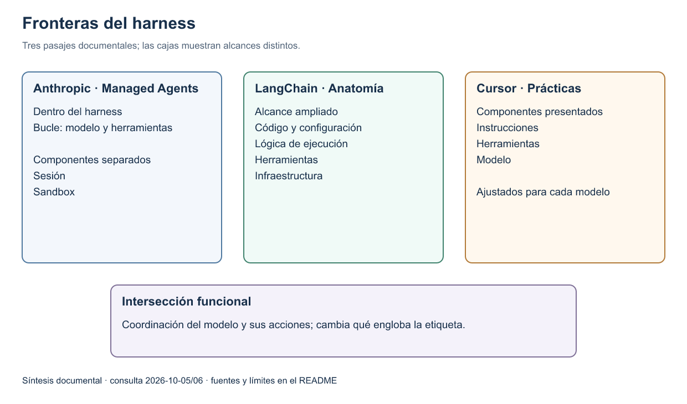
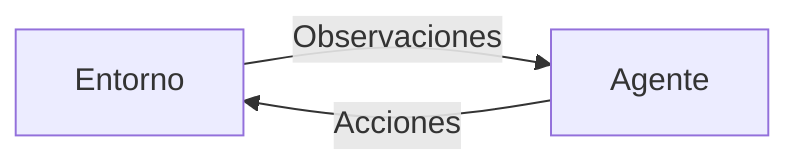
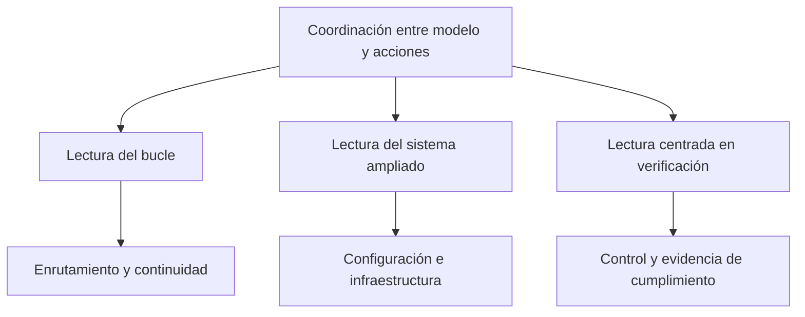
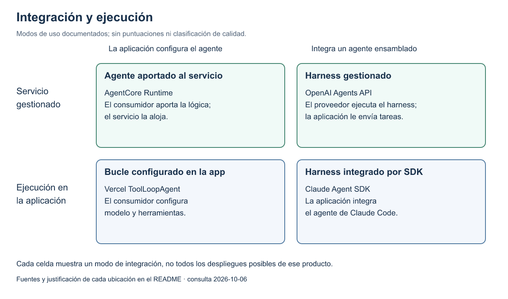
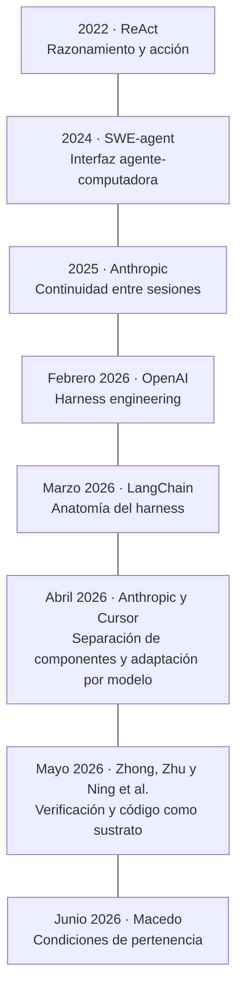
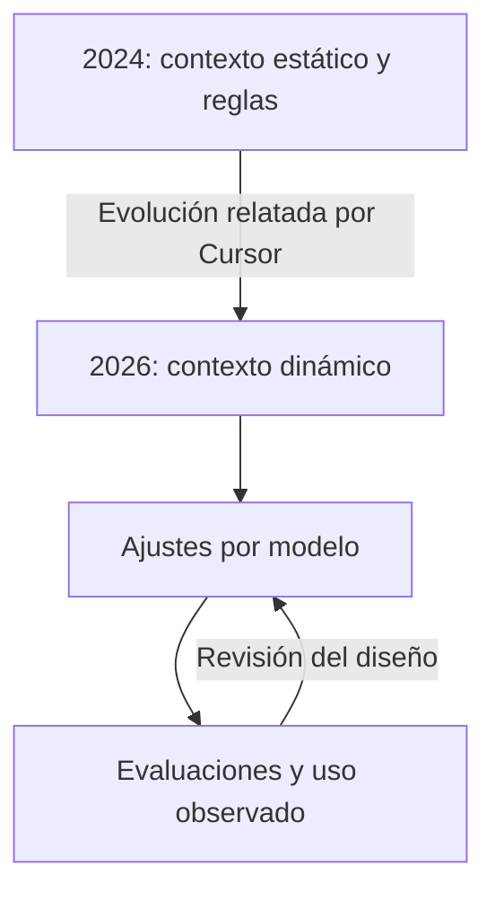

# Definiciones y alcance de harness

El término *harness* aparece en definiciones conceptuales, arquitecturas, productos y prácticas de ingeniería. Este estudio compara qué objeto describe cada fuente, qué responsabilidades incluye y dónde sitúa sus fronteras. La coincidencia de vocabulario no implica equivalencia entre implementaciones.

## Alcance y método

**Corte documental: 2026-10-06.** El corpus contiene 39 proyectos con repositorio, documentación de productos y servicios gestionados, dos libros y seis artículos de investigación. La biblioteca reúne 67 fuentes y 67 observaciones. Las lecturas del 5 de octubre conservan su fecha y commit; la ampliación del 6 de octubre no vuelve a validarlas implícitamente.

Se seleccionaron fuentes primarias para contrastar ejecución mínima, composiciones integradas, integración empresarial, continuidad, infraestructura gestionada y evaluación. En los libros se examinaron pasajes sobre agentes; en los artículos, las definiciones y mecanismos pertinentes; en los repositorios, presentación y arquitectura documentada. No se ejecutó software ni se replicaron experimentos. El número de proyectos no equivale al número de definiciones explícitas de harness.

Las observaciones y sus datos bibliográficos viven en [observations.json](observations.json). Cada afirmación identifica fuentes y localizadores. El [manifiesto](manifest.json) conserva el corte y el hash de ese archivo. Los READMEs se fijan a commits; las páginas vivas conservan la fecha de consulta, sin garantizar una copia histórica de su contenido. La bibliografía final es una vista generada de esos mismos datos.

La selección incluye código público y productos comerciales. La licencia de un SDK no determina la del agente que ejecuta ni la de todos sus componentes. Quedan fuera una auditoría de licencias, una comparación de rendimiento y un censo exhaustivo de proveedores. La publicación de un preprint tampoco demuestra consenso o revisión por pares. La formulación que adopte la wiki se trabajará en el [concepto de harness](../../concepts/harness/README.md), por separado.

## Cómo lo define cada fuente

Las siguientes formulaciones son paráfrasis en español. Se distingue entre **definición conceptual**, **frontera arquitectónica** y **autodescripción de producto**. Una autodescripción muestra qué quiere ofrecer el proyecto; no establece por sí sola una definición universal.

| Fuente y tipo de pasaje | Formulación de la fuente | Diferencia que conviene conservar |
|---|---|---|
| [Anthropic: evaluaciones](https://www.anthropic.com/engineering/demystifying-evals-for-ai-agents) · definición | Sistema que permite actuar al modelo: procesa entradas, orquesta llamadas a herramientas y devuelve resultados. | Separa expresamente agent harness y evaluation harness. |
| [Anthropic: Managed Agents](https://www.anthropic.com/engineering/managed-agents) · arquitectura | Bucle que llama a Claude y dirige sus solicitudes de herramientas a la infraestructura correspondiente. | La sesión y el sandbox son componentes separados. |
| [Anthropic: tareas prolongadas](https://www.anthropic.com/engineering/effective-harnesses-for-long-running-agents) · diseño | El SDK es un harness general; para continuar entre sesiones se agregan preparación del entorno y artefactos que conservan el progreso. | La continuidad requiere diseño del trabajo; compactar contexto no resuelve por sí solo todo el problema. |
| [Anthropic: gobernanza](https://www.anthropic.com/research/trustworthy-agents) · descripción de componentes | Instrucciones y guardrails bajo los que opera el modelo. | En este texto, herramientas y entorno quedan fuera de esa etiqueta. |
| [OpenAI: sandbox agents](https://developers.openai.com/api/docs/guides/agents/sandboxes) · arquitectura | Plano de control: bucle, llamadas al modelo, enrutamiento de herramientas, aprobaciones y estado. | El cómputo que ejecuta acciones se distingue del control. |
| [OpenAI: Codex](https://developers.openai.com/blog/codex-as-a-platform) · descripción de sistema | Sistema de ejecución que mantiene contexto, utiliza herramientas y conduce el trabajo alrededor del modelo. | El mismo harness puede servir a distintas interfaces y aplicaciones. |
| [LangChain: anatomía](https://www.langchain.com/blog/the-anatomy-of-an-agent-harness) · definición | Código, configuración y lógica de ejecución externos al modelo. | Alcance amplio: incluye prompts, herramientas, infraestructura y orquestación. |
| [LangChain: categorías](https://docs.langchain.com/oss/python/concepts/products) · clasificación de productos | Harness como framework con decisiones y capacidades ya incorporadas. | Lo diferencia de las abstracciones del framework y de la infraestructura del runtime. |
| [Pydantic AI Harness](https://pydantic.dev/docs/ai/harness/) · composición | El agente básico ya tiene un harness ligero; capacidades adicionales componen harnesses para tareas más complejas. | No hay una frontera absoluta entre framework y harness. |
| [Strands harness](https://strandsagents.com/docs/user-guide/harness/) · producto | Agente ensamblado con configuración predeterminada de herramientas, contexto, sesiones, memoria y hooks. | La configuración ensamblada se distingue del SDK para construirla. |
| [Pi](https://github.com/earendil-works/pi/blob/28dcce2ba45ce4a9efeb0f5b686f0be830fd89b9/README.md) · producto | Harness mínimo y extensible. Extensiones, skills y plantillas; evita imponer subagentes y modo de planificación en el núcleo. | Un harness no necesita incluir todas las capacidades avanzadas. |
| [Deep Agents](https://github.com/langchain-ai/deepagents/blob/3086f7b918b53b12a6ad675231ebd4752d4a420a/README.md) · producto | Harness con capacidades y decisiones predeterminadas. Sistema de archivos, subagentes, contexto y skills sobre LangChain y LangGraph. | Distinguir paquete ensamblado de los componentes sobre los que se construye. |
| [DeerFlow](https://github.com/bytedance/deer-flow/blob/d8bdd7552c6ecb49f82519d35c07f161be7d6c0f/README.md) · producto | Super agent harness, denominación del proyecto. Orquestación de subagentes, memoria, sandboxes y skills. | Ejemplo de alcance amplio y configuración integrada. |
| [Letta Code](https://github.com/letta-ai/letta-code/blob/4b028fab07c69edaac2ddb4f7b9a43573ff20d81/README.md) · producto | Harness agéntico con estado. Memoria, identidad y continuidad a lo largo de interacciones. | Estudiar la continuidad como eje de diseño; la mejora declarada requiere evaluación. |

La variación dentro de Anthropic es especialmente útil: el artículo de gobernanza reserva *harness* para instrucciones y controles, mientras que el de arquitectura lo usa para un bucle de ejecución. Son pasajes con objetivos y fronteras distintos. La wiki debe atribuir la perspectiva al documento concreto, evitando hablar de «la definición de Anthropic» como si fuese una sola.

### Ingeniería y criterios de delimitación

| Fuente | Qué está describiendo | Aporte y frontera |
|---|---|---|
| [OpenAI: Agents API](https://developers.openai.com/api/docs/guides/agents-api/architecture) | Arquitectura de un servicio gestionado. | Separa harness, entorno y servidor de aplicación. Puede usar herramientas remotas sin un sandbox propio. |
| [OpenAI: harness engineering](https://openai.com/index/harness-engineering/) | Práctica de desarrollo con agentes. | Preparación del entorno, intención, conocimiento del repositorio y feedback. Su objeto excede el código del bucle. |
| [Cursor: prácticas](https://cursor.com/blog/agent-best-practices) | Presentación del agente. | Enumera instrucciones, herramientas y modelo; difiere de las definiciones que excluyen el modelo del harness. |
| [Cursor: evolución](https://cursor.com/blog/continually-improving-agent-harness) | Ingeniería de un producto. | Ajusta contexto, herramientas y prompts por modelo mediante evaluación. La implementación cambia con las capacidades del modelo. |
| [Vercel AI SDK](https://ai-sdk.dev/docs/agents/overview) | Abstracciones de integración. | ToolLoopAgent construye el bucle; HarnessAgent integra uno preconfigurado. Separa estado del servidor y contexto enviado al modelo. |
| [Macedo](https://arxiv.org/html/2606.10106v1), §4 | Definición constitutiva propuesta. | Exige bucle, acción sobre el entorno, contexto activo y control independiente del modelo. Sus umbrales son más restrictivos que algunas autodescripciones comerciales. |
| [Zhong y Zhu](https://arxiv.org/html/2605.13357v1) | Soporte de ejecución para ingeniería de software. | Incluye atribución de fallos, verificación y mantenimiento entre once responsabilidades. Propone cómo estudiar ese soporte. |
| [Ning et al.](https://arxiv.org/html/2605.18747v1) | Código como sustrato del agente. | Distingue interfaces, mecanismos y coordinación; el código sirve para actuar y verificar, además de ser un posible resultado. |
| [Barbaste et al.](https://arxiv.org/html/2609.00006v1), §2 | Anatomía de agentes de código. | Propone siete dimensiones, incluyendo integración con modelos, seguridad y extensiones. Su corpus no representa todos los agentes empresariales. |

Los artículos aportan hipótesis y criterios de comparación, no una nomenclatura ya resuelta. Por ejemplo, el criterio de Macedo exige modificar un entorno y seleccionar contexto según la tarea; no basta con truncar por longitud. Esto deja preguntas concretas para contrastar con harnesses mínimos o agentes de consulta. El desacuerdo relevante es el **umbral de pertenencia**, además de la lista de componentes. [Macedo, §4](https://arxiv.org/html/2606.10106v1).

*Figura 1. Síntesis de fronteras documentales. Las cajas representan el alcance de cada pasaje, no servicios obligatorios. Anthropic mantiene sesión y sandbox separados del bucle; LangChain usa una definición amplia; Cursor incluye el modelo en su presentación de componentes. Fuentes: [Managed Agents](https://www.anthropic.com/engineering/managed-agents), [anatomía de LangChain](https://www.langchain.com/blog/the-anatomy-of-an-agent-harness), [prácticas de Cursor](https://cursor.com/blog/agent-best-practices). [SVG](figures/harness-boundaries.svg) · [editable Draw.io](figures/harness-boundaries.drawio).*

### Antecedentes conceptuales

En el capítulo sobre agentes de **Russell y Norvig**, el agente percibe y actúa sobre un entorno. La función que relaciona percepciones con acciones se distingue del programa que la implementa. En **Sutton y Barto**, la interfaz agente–entorno formaliza una secuencia de estados, acciones y recompensas. Son antecedentes para describir interacción y decisión; esos pasajes no definen *agent harness*. [AIMA, §2.1, pp. 32–34 del extracto](https://aima.cs.berkeley.edu/4th-ed/pdfs/newchap02.pdf); [Reinforcement Learning, 2.ª ed., §3.1, pp. 47–49](http://incompleteideas.net/book/RLbook2020.pdf).

*Figura 2. Abstracción de interacción basada en los pasajes de ambos libros. Se omite la recompensa porque esta vista no presupone aprendizaje por refuerzo. Tampoco presupone LLM, herramientas HTTP o memoria persistente.*

**ReAct** estudia la intercalación de razonamiento textual y acciones; **SWE-agent** estudia interfaces de computadora diseñadas para agentes. Ambos permiten abrir mecanismos que luego aparecen en harnesses, sin convertir un patrón de interacción o una interfaz en una definición completa del sistema. [ReAct, §2](https://arxiv.org/html/2210.03629v3); [SWE-agent](https://arxiv.org/html/2405.15793v3).

## Proyectos examinados

Las columnas de énfasis resumen lo que declaran los documentos. La última columna contiene nuestra interpretación para el estudio. La ausencia de una capacidad en estas filas significa que no se examinó aquí, no que el proyecto carezca de ella. Cada nombre enlaza el README en un commit fijo; las referencias complementarias de las filas anteriores precisan los casos donde el README no define harness.

### Harnesses y composiciones explícitas

| Proyecto | Cómo se presenta | Énfasis declarado | Aporte a la comparación |
|---|---|---|---|
| [Codex](https://github.com/openai/codex/blob/5ad689169645a953ec7380762c4ae596712057ee/README.md) | Agente de código; el artículo de OpenAI denomina harness al sistema subyacente. | Bucle, contexto, herramientas y políticas de ejecución. | Distinguir interfaz de usuario y harness reutilizable. |
| [Claude Agent SDK](https://github.com/anthropics/claude-agent-sdk-python/blob/7bb2753754c9725bccc972a5530ae8d572921658/README.md) | SDK que expone el agente de Claude Code; Anthropic lo describe como harness de propósito general. | Bucle, herramientas y gestión de contexto integrados. | Distinguir biblioteca de integración, binario ejecutado y servicio alojado. |
| [Pi](https://github.com/earendil-works/pi/blob/28dcce2ba45ce4a9efeb0f5b686f0be830fd89b9/README.md) | Harness mínimo y extensible. | Extensiones, skills y plantillas; evita imponer subagentes y modo de planificación en el núcleo. | Un harness no necesita incluir todas las capacidades avanzadas. |
| [Deep Agents](https://github.com/langchain-ai/deepagents/blob/3086f7b918b53b12a6ad675231ebd4752d4a420a/README.md) | Harness con capacidades y decisiones predeterminadas. | Sistema de archivos, subagentes, contexto y skills sobre LangChain y LangGraph. | Distinguir paquete ensamblado de los componentes sobre los que se construye. |
| [Strands](https://github.com/strands-agents/harness-sdk/blob/d6faa6ece53c38ac0f05b19713cdd14112c21150/README.md) | Harness ensamblado y SDK para construir harnesses. | Valores predeterminados para herramientas, contexto, sesiones, memoria y hooks. | Separar la configuración lista para usar de las primitivas de construcción. |
| [Pydantic AI / Harness](https://github.com/pydantic/pydantic-ai/blob/62013d9fa54e441e03a792ba8c26c20b56d55291/README.md) | Framework y biblioteca de capacidades y harnesses componibles. | Bucle tipado en el núcleo; capacidades que componen agentes como Coder y Researcher. | La frontera del paquete no constituye una frontera conceptual universal. |
| [DeerFlow](https://github.com/bytedance/deer-flow/blob/d8bdd7552c6ecb49f82519d35c07f161be7d6c0f/README.md) | Super agent harness, denominación del proyecto. | Orquestación de subagentes, memoria, sandboxes y skills. | Ejemplo de alcance amplio y configuración integrada. |
| [Letta Code](https://github.com/letta-ai/letta-code/blob/4b028fab07c69edaac2ddb4f7b9a43573ff20d81/README.md) | Harness agéntico con estado. | Memoria, identidad y continuidad a lo largo de interacciones. | Estudiar la continuidad como eje de diseño; la mejora declarada requiere evaluación. |
| [GitHub Copilot SDK](https://github.com/github/copilot-sdk/blob/6f67591aea97825b61bd866130f3ab6e96688f07/README.md) | Runtime de Copilot CLI accesible por SDK. | Planificación, herramientas y edición gestionadas por el motor. | Una API de integración puede exponer un agente ensamblado. |

### Aplicaciones y agentes

| Proyecto | Cómo se presenta | Énfasis declarado | Aporte a la comparación |
|---|---|---|---|
| [OpenCode](https://github.com/anomalyco/opencode/blob/772392050500e0ddcd2ad2193411a22a3824372f/README.md) | Agente de código abierto. | Agentes build y plan con reglas de acceso diferentes; subagente general. | Comparar configuraciones de control dentro de un mismo producto. |
| [Gemini CLI](https://github.com/google-gemini/gemini-cli/blob/fb972b2f87fe7d5b06d37eac711490162d98de2c/README.md) | Agente de IA para la terminal. | Operaciones de archivos, shell, búsqueda y extensiones MCP. | La interfaz terminal y las herramientas describen un producto, no una definición universal de harness. |
| [goose](https://github.com/aaif-goose/goose/blob/104ddde585112af6f074f912f3ceb405fb5b800e/README.md) | Agente de propósito general que se ejecuta en la máquina del usuario. | Interfaces de escritorio, CLI y API; extensiones MCP. | Separar el dominio de uso de la interfaz y del conjunto de integraciones. |
| [Cline](https://github.com/cline/cline/blob/c00bf86595d2fee6665fa3b27091d95e57578013/README.md) | Agente de código en IDE, terminal y escritorio. | Reglas del proyecto y skills para orientar el trabajo. | Examinar políticas y superficie de interacción como dimensiones separadas. |
| [Aider](https://github.com/Aider-AI/aider/blob/5dc9490bb35f9729ef2c95d00a19ccd30c26339c/README.md) | Programación en pareja con IA en la terminal. | Trabajo sobre código existente y mapa del repositorio. | El contexto del repositorio es una decisión concreta de ensamblaje. |
| [SWE-agent](https://github.com/SWE-agent/SWE-agent/blob/3ea751c087f32b16e039a2233dd6eefecef325d5/README.md) | Agente que permite a un modelo usar herramientas para resolver tareas de software. | Interacción con repositorios y configuración para investigación. | Aporta un antecedente de diseño; su README recomienda mini-swe-agent para trabajo nuevo. |
| [mini-swe-agent](https://github.com/SWE-agent/mini-swe-agent/blob/04d809ceab9df28f9adaed044884180159172930/README.md) | Agente mínimo de ingeniería de software. | Bash, historial lineal y acciones ejecutadas de forma independiente. | Contraejemplo a exigir APIs nativas de tool calling o un shell persistente para definir un harness. |
| [Hermes Agent](https://github.com/NousResearch/hermes-agent/blob/7b2ff7a7d4e84a1018eecb27e606a485f65435f1/README.md) | Agente con aprendizaje continuo, según la presentación de sus autores. | Memoria, creación de skills y recuperación de conversaciones. | Separar mecanismos declarados de afirmaciones de mejora; no se verificó rendimiento. |
| [Mistral Vibe](https://github.com/mistralai/mistral-vibe/blob/7c19608af06f6c61d63f8f7a5c3430da73fba2ab/README.md) | Agente de código para terminal. | Contexto del proyecto, herramientas, perfiles de permisos y delegación. | Comparar perfiles concretos; el modo de aprobación cambia el comportamiento. |
| [Qwen Code](https://github.com/QwenLM/qwen-code/blob/4619e4173498b80bd4c0647fb42a2e9ff17232b8/README.md) | Agente de código con varias interfaces. | Memoria, skills, subagentes, equipos y proveedores configurables. | La interfaz de terminal no delimita el alcance del sistema. |
| [OpenClaw](https://github.com/openclaw/openclaw/blob/ac304b9f9944d29364bd88ca8a2e10314ca28ac3/README.md) | Asistente personal con canales e integraciones. | Estado local y harnesses intercambiables como plugins. | Una aplicación puede alojar harnesses; no equivale al bucle que aloja. |
| [AutoGPT](https://github.com/Significant-Gravitas/AutoGPT/blob/f8b0e0a87c38b67f6e6cb21f3ee03ff5584c3588/README.md) | Plataforma para construir y ejecutar agentes. | Oferta gestionada, autoalojamiento y rama Classic. | Distinguir componentes: Platform declara Polyform Shield y Classic MIT. |

### Frameworks, runtimes y SDKs

| Proyecto | Cómo se presenta | Énfasis declarado | Aporte a la comparación |
|---|---|---|---|
| [OpenAI Agents SDK](https://github.com/openai/openai-agents-python/blob/d7e52c375021248973f60ccbea8e7b69bc5b16e3/README.md) | Framework para flujos multiagente. | Agentes, herramientas, handoffs, guardrails, sesiones y trazas. | Primitivas para construir un sistema; no confundirlas con una aplicación configurada. |
| [LangChain](https://github.com/langchain-ai/langchain/blob/7ca02f333aa6d5e4cf566a2dcc444d06758e2958/README.md) | Framework para agentes y aplicaciones basadas en LLM. | Componentes e integraciones interoperables. | El framework contiene construcciones de harness: Deep Agents llama harness mínimo a create_agent. |
| [LangGraph](https://github.com/langchain-ai/langgraph/blob/2d942085e214ef6b99b6f54ed4d544a7c7c5ac56/README.md) | Framework de orquestación de bajo nivel para agentes con estado. | Ejecución duradera, intervención humana y persistencia. | Responsabilidades de runtime que un harness puede utilizar. |
| [OpenHands Software Agent SDK](https://github.com/OpenHands/software-agent-sdk/blob/cb7eabaf7b784a2f58f9df35d610f106287e823b/README.md) | SDK para construir agentes que trabajan con código. | Agentes y conversaciones con workspaces locales o remotos mediante Agent Server. | Separar definición del agente, conversación, herramientas y lugar de ejecución. |
| [smolagents](https://github.com/huggingface/smolagents/blob/c30b115286e000e98711fae5e85993547b73d826/README.md) | Biblioteca de agentes con abstracciones pequeñas. | CodeAgent expresa acciones como código; admite entornos de ejecución aislados. | Agente que usa código para actuar no equivale a agente dedicado a programar. |
| [Google ADK](https://github.com/google/adk-python/blob/71d5ed77382865c419a57692d68c296866efe2e5/README.md) | Framework flexible y modular de desarrollo de agentes. | Workflows, runtime, delegación y herramientas. | Un framework puede incluir mecanismos de runtime; las categorías se solapan. |
| [Microsoft Agent Framework](https://github.com/microsoft/agent-framework/blob/b9d24c8fb484c8330abe8bb9e7500ca3c3bbf46c/README.md) | Framework para agentes y flujos multiagente. | Middleware, grafos, checkpoints, streaming y observabilidad. | Evaluar componentes de una configuración; MAF es una tecnología, harness es un concepto. |
| [Mastra](https://github.com/mastra-ai/mastra/blob/a793ec23949ee59b4aa850d83f9e1eba365ac5c8/README.md) | Framework TypeScript para aplicaciones y agentes. | Agentes, workflows y gestión de contexto y memoria. | Distinguir marco de desarrollo, mecanismos integrados y aplicación resultante. |
| [Agno](https://github.com/agno-agi/agno/blob/c44b082010d925d083b945798deb82ae8fb9429e/README.md) | Framework y runtime para plataformas de agentes. | Construcción de agentes y ejecución como servicio mediante AgentOS. | La propia descripción combina framework y runtime; no forzar una etiqueta excluyente. |
| [CrewAI](https://github.com/crewAIInc/crewAI/blob/1133f16cab274b9863b36fdacca7766b30e549fd/README.md) | Framework para flujos multiagente. | Crews de agentes y Flows dirigidos por eventos. | Estudiar colaboración y control del flujo, sin asumir que multiagente sea requisito de harness. |
| [LlamaIndex](https://github.com/run-llama/llama_index/blob/81f0e06f6e61a5659bd409cac4a199e28c2fd85e/README.md) | Framework de aplicaciones agénticas y ecosistema documental. | Integración de datos; distingue toolkit y plataforma LlamaParse. | Recuperación y procesamiento documental aportan contexto, no una definición de harness. |
| [Haystack](https://github.com/deepset-ai/haystack/blob/ff1343764790ce1da1ffb38a049232d91b334b62/README.md) | Framework de orquestación de IA. | Pipelines, agentes, recuperación, memoria y hooks. | Control explícito del flujo y ensamblaje del contexto. |
| [AutoGen](https://github.com/microsoft/autogen/blob/027ecf0a379bcc1d09956d46d12d44a3ad9cee14/README.md) | Framework multiagente. | Core con mensajes y runtime; AgentChat con patrones de interacción. | El README indica mantenimiento y remite a MAF; no fecha aquí la transición. |
| [Semantic Kernel](https://github.com/microsoft/semantic-kernel/blob/dcb969fbe624dc4efa462c2079831690425b98fd/README.md) | SDK de orquestación independiente del modelo. | Agentes, plugins y procesos; remite a MAF como sucesor. | Distinguir mecanismo, producto y trayectoria de migración. |
| [Vercel AI SDK](https://github.com/vercel/ai/blob/3a1072d9b0e799e9005ae75970d1e38d3506a549/packages/ai/README.md) | Toolkit TypeScript independiente del proveedor. | API de modelos e integración de aplicaciones. | La documentación complementaria distingue ToolLoopAgent de HarnessAgent. |
| [LangChain4j](https://github.com/langchain4j/langchain4j/blob/c00c3af7be03f33c03cce4ed61d6a3b23a560d5f/README.md) | Biblioteca Java para aplicaciones con LLM. | APIs, memoria, herramientas, agentes y RAG. | Responsabilidades componibles en el ecosistema JVM. |
| [Spring AI](https://github.com/spring-projects/spring-ai/blob/ed06de79fc3d18759117045dd71bcec9f2813792/README.md) | Abstracciones de integración para aplicaciones Spring. | Modelos, datos, herramientas, memoria y Advisors. | Los mecanismos de integración no definen por sí solos un agente completo. |

### Harness de evaluación

| Proyecto | Cómo se presenta | Énfasis declarado | Aporte a la comparación |
|---|---|---|---|
| [LM Evaluation Harness](https://github.com/EleutherAI/lm-evaluation-harness/blob/d6de81643928d653435c431bae19945d41d32520/README.md) | Framework para evaluar modelos de lenguaje. | Tareas y ejecución de evaluaciones. | Comparador terminológico: evaluation harness no es sinónimo de agent harness. |

### Productos y servicios gestionados

| Servicio | Responsabilidad documentada | Qué no permite concluir esta lectura |
|---|---|---|
| [OpenAI Agents API](https://developers.openai.com/api/docs/guides/agents-api/architecture) | Ejecuta un harness gestionado y permite conectar entornos y herramientas. | La interfaz pública no equivale a una auditoría del servicio. |
| [Anthropic Managed Agents](https://www.anthropic.com/engineering/managed-agents) | Separa el bucle, la sesión y el sandbox. | No establece una frontera universal para todos los productos de Anthropic. |
| [Cursor](https://cursor.com/blog/continually-improving-agent-harness) | Ajusta el harness por modelo y evalúa cambios de contexto y herramientas. | Las mejoras relatadas por el proveedor no se replicaron en este estudio. |
| [Devin](https://docs.devin.ai/get-started/devin-intro) | Agente con shell, IDE, navegador e intervención del usuario. | La documentación examinada describe el producto; no formaliza su harness interno. |
| [AWS AgentCore Runtime](https://docs.aws.amazon.com/bedrock-agentcore/latest/devguide/agents-tools-runtime.html) | Alojamiento de agentes y herramientas con aislamiento y servicios operativos. | El alojamiento no determina qué bucle o framework implementa el agente. |
| [Google Agent Runtime](https://docs.cloud.google.com/gemini-enterprise-agent-platform/build/runtime) | Despliegue y operación gestionados de aplicaciones agénticas. | El nombre runtime no lo hace equivalente al runtime de un framework. |

Los READMEs examinados de AutoGen y Semantic Kernel remiten a MAF; no establecen por sí solos la fecha de transición. AutoGPT distingue licencias entre Platform y Classic. En Vercel, la distinción ToolLoopAgent/HarnessAgent procede de la [documentación de agentes](https://ai-sdk.dev/docs/agents/overview), complementaria al README.

## Normalización del vocabulario

Se propone comparar responsabilidades y después relacionarlas con componentes de cada implementación. La columna de equivalencias permite conectar vocabulario; no afirma que las implementaciones sean intercambiables.

| Dimensión | Términos próximos en las fuentes | Aspecto que debe precisarse |
|---|---|---|
| Control | agent loop, runner, orchestration | Quién invoca el modelo y quién decide continuar, delegar o terminar. |
| Entrada al modelo | context management, assembly, prompt construction | Qué información se selecciona, transforma y entrega en cada llamada. |
| Acciones | tools, code execution, shell, integrations | Cómo una salida se convierte en una operación y cómo vuelve el resultado. |
| Continuidad | state, session, history, checkpoint, memory | Qué se conserva, durante cuánto tiempo y para qué uso; son objetos relacionados, no sinónimos. |
| Restricciones | permissions, guardrails, hooks, policies | Qué regla se aplica, dónde se aplica y si previene, interrumpe o registra una acción. |
| Entorno | workspace, sandbox, compute | Dónde ocurren los efectos; un workspace no implica aislamiento. |
| Construcción | framework, SDK, capabilities, extensions | Qué se reutiliza y qué debe configurar la aplicación. |
| Evaluación | tracing, evals, benchmarks | Las trazas describen ejecuciones; los criterios de evaluación determinan cómo juzgarlas. |

Esta matriz permite describir MAF como una tecnología que aporta mecanismos de varias dimensiones, y harness como un concepto sobre la coordinación del sistema. No los coloca al mismo nivel ni convierte todos los productos en capas excluyentes.

### Solapamientos por responsabilidad

La siguiente matriz compara **pasajes**, no capacidades completas de productos. «Explícito» significa que el texto examinado incluye esa responsabilidad en su explicación; «separado» que la sitúa en otro componente; «sin resolver» que no basta ese pasaje para decidir. Una celda vacía nunca se interpreta como ausencia técnica.

| Perspectiva | Bucle y acciones | Contexto | Controles | Infraestructura |
|---|---|---|---|---|
| [Anthropic Managed Agents](https://www.anthropic.com/engineering/managed-agents) | Explícito en harness | Relación con sesión | Sin resolver como frontera única | Sandbox separado |
| [LangChain: anatomía](https://www.langchain.com/blog/the-anatomy-of-an-agent-harness) | Explícito | Explícito | Parte del diseño descrito | Incluida en alcance amplio |
| [Macedo, §4](https://arxiv.org/html/2606.10106v1) | Condición necesaria | Selección activa necesaria | Condición necesaria | No fija un proveedor de alojamiento |
| [Zhong y Zhu](https://arxiv.org/html/2605.13357v1) | Interacción con proyecto | Responsabilidad explícita | Permisos y verificación | Soporte durante la tarea |

*Figura 3. Intersección funcional y extensiones de alcance. Es una síntesis comparativa de los cuatro pasajes de la matriz: no una jerarquía de productos ni una definición adoptada. Las ramas pueden coexistir en la misma implementación.*

### Dos dimensiones de integración

*Figura 4. Mapa cualitativo: quién configura el agente —la aplicación o el proveedor del harness— y dónde se ejecuta esa lógica —en la aplicación o como servicio gestionado—. Son modos de uso documentados, no puntuaciones ni categorías exclusivas. [SVG](figures/integration-map.svg) · [editable Draw.io](figures/integration-map.drawio).*

| Ejemplo situado en el mapa | Justificación |
|---|---|
| Vercel ToolLoopAgent: bucle configurado / aplicación | [El consumidor configura modelo y herramientas](https://ai-sdk.dev/docs/agents/overview). |
| Claude Agent SDK: ensamblado / aplicación | [Expone el bucle y las herramientas de Claude Code](https://code.claude.com/docs/en/agent-sdk/overview). |
| AgentCore Runtime: agente aportado / servicio | [Aloja código del consumidor con distintos frameworks](https://docs.aws.amazon.com/bedrock-agentcore/latest/devguide/agents-tools-runtime.html). El servicio de alojamiento no selecciona el agente. |
| OpenAI Agents API: ensamblado / servicio | [El proveedor ejecuta el harness](https://developers.openai.com/api/docs/guides/agents-api/architecture). |

Un SDK de un harness ensamblado puede ofrecer gran extensibilidad; un runtime gestionado puede alojar un bucle mínimo. Por eso este mapa no se lee como una escala de sofisticación. La configuración y el modo de despliegue importan tanto como el nombre del producto.

## Evolución

### Hitos documentales

*Figura 5. Fechas de publicación de [ReAct](https://arxiv.org/abs/2210.03629), [SWE-agent](https://arxiv.org/abs/2405.15793), [continuidad](https://www.anthropic.com/engineering/effective-harnesses-for-long-running-agents), [OpenAI](https://openai.com/index/harness-engineering/), [LangChain](https://www.langchain.com/blog/the-anatomy-of-an-agent-harness), [Managed Agents](https://www.anthropic.com/engineering/managed-agents), [Cursor](https://cursor.com/blog/continually-improving-agent-harness), [Zhong y Zhu](https://arxiv.org/abs/2605.13357), [Ning et al.](https://arxiv.org/abs/2605.18747) y [Macedo](https://arxiv.org/abs/2606.10106). No representa el nacimiento del término ni una relación causal entre publicaciones.*

### Evolución dentro de una implementación

Cursor describe un desplazamiento desde contexto inicial abundante y reglas explícitas hacia recuperación dinámica y ajustes específicos de cada modelo. El cambio relatado altera la distribución de decisiones entre código, instrucciones y modelo; no elimina la necesidad de un harness. [Cursor: Evolving the context window](https://cursor.com/blog/continually-improving-agent-harness).

*Figura 6. Síntesis del relato de Cursor publicado el 30 de abril de 2026. La flecha temporal no cuantifica mejora; el bucle representa su proceso de ajuste, no una ejecución del agente.*

La cronología de versiones de cada proyecto requiere comparar releases o commits históricos; un README actual no permite reconstruirla. Los avisos de migración de AutoGen y Semantic Kernel sirven como evidencia del estado observado, pero quedan fuera de una fecha de transición no comprobada. El artículo de Barbaste et al. queda fuera de la cronología porque la fecha de su ficha y el prefijo del identificador requieren contraste.

## Coincidencias y diferencias

**Coordinación compartida, fronteras distintas.** Las perspectivas de ejecución conectan modelo, acciones y resultados mediante software, pero no coinciden en qué queda dentro del harness. Managed Agents distingue bucle, sesión y sandbox; LangChain incluye código, configuración e infraestructura; Cursor incorpora el modelo en una presentación de componentes. La intersección está en la coordinación, mientras la frontera depende del objeto descrito. [Anthropic](https://www.anthropic.com/engineering/managed-agents), [LangChain](https://www.langchain.com/blog/the-anatomy-of-an-agent-harness), [Cursor](https://cursor.com/blog/agent-best-practices).

**Descripción y requisito no son equivalentes.** Una autodescripción muestra cómo se presenta un producto. Macedo propone, en cambio, condiciones necesarias y suficientes. Contrastar esas condiciones con un harness mínimo requiere comprobar los mecanismos, especialmente selección de contexto y control independiente. La palabra utilizada por un proyecto no demuestra que satisfaga una definición académica concreta. [Macedo, §4](https://arxiv.org/html/2606.10106v1); [Pi](https://github.com/earendil-works/pi/blob/28dcce2ba45ce4a9efeb0f5b686f0be830fd89b9/README.md).

**Composición e integración conviven.** Pi evita imponer ciertas capacidades en el núcleo; Deep Agents y Strands ofrecen decisiones incorporadas; Pydantic añade capacidades componibles. Vercel distingue construir el bucle de integrar un harness existente. Estos casos no forman una escalera universal: describen diferentes decisiones sobre qué aporta la biblioteca y qué configura la aplicación. [Pi](https://github.com/earendil-works/pi/blob/28dcce2ba45ce4a9efeb0f5b686f0be830fd89b9/README.md), [Deep Agents](https://github.com/langchain-ai/deepagents/blob/3086f7b918b53b12a6ad675231ebd4752d4a420a/README.md), [Strands](https://strandsagents.com/docs/user-guide/harness/), [Pydantic](https://pydantic.dev/docs/ai/harness/), [Vercel](https://ai-sdk.dev/docs/agents/overview).

**Runtime tiene varios objetos.** Puede designar el motor que ejecuta un bucle, la ejecución de un grafo o el alojamiento gestionado de una aplicación. Las responsabilidades se solapan sin ser intercambiables. La compatibilidad con un framework no significa que el servicio de infraestructura implemente su estrategia de contexto o planificación. [LangChain: categorías](https://docs.langchain.com/oss/python/concepts/products), [Copilot SDK](https://github.com/github/copilot-sdk/blob/6f67591aea97825b61bd866130f3ab6e96688f07/README.md), [AWS](https://docs.aws.amazon.com/bedrock-agentcore/latest/devguide/agents-tools-runtime.html), [Google Cloud](https://docs.cloud.google.com/gemini-enterprise-agent-platform/build/runtime).

**Contexto, estado y memoria deben examinarse por mecanismo.** Vercel distingue estado de ejecución y contexto para el modelo; Anthropic describe artefactos de continuidad entre sesiones. Conservar un dato no implica incorporarlo a la siguiente llamada. Esto abre una comparación más precisa: qué se guarda, qué se selecciona, cuándo se ensambla y qué permanece fuera de la ventana. [Vercel](https://ai-sdk.dev/docs/agents/overview), [Anthropic: continuidad](https://www.anthropic.com/engineering/effective-harnesses-for-long-running-agents).

**La interfaz de acción no fija el dominio.** ReAct combina acciones y observaciones; SWE-agent examina interfaces para programación; Ning et al. estudian código como sustrato de acción en distintos dominios. Que un agente genere código para usar herramientas no significa que su tarea final sea desarrollar software. [ReAct](https://arxiv.org/html/2210.03629v3), [SWE-agent](https://arxiv.org/html/2405.15793v3), [Code as Agent Harness](https://arxiv.org/html/2605.18747v1).

**Ingeniería del harness y evaluación se conectan sin confundirse.** OpenAI describe preparación del entorno y feedback; Zhong y Zhu añaden verificación y atribución de fallos como objetos de estudio. El sistema que actúa y el que califica esa actuación pueden compartir infraestructura, pero responden a preguntas distintas. Una mejora de rendimiento exigiría mantener identificados tarea, modelo, configuración y criterio de evaluación; este barrido documental no la demuestra. [OpenAI](https://openai.com/index/harness-engineering/), [Zhong y Zhu](https://arxiv.org/html/2605.13357v1), [Anthropic: evaluación](https://www.anthropic.com/engineering/demystifying-evals-for-ai-agents).

## Referencias

Datos bibliográficos mantenidos en `observations.json`. Las citas locales identifican qué afirmación respalda cada fuente; esta lista permite recuperar los documentos.

<!-- references:start -->
- openai. [Codex — README](https://github.com/openai/codex/blob/5ad689169645a953ec7380762c4ae596712057ee/README.md). revisión 5ad689169645; consulta 2026-10-05.
- OpenAI. [Codex as a platform: build on the open agent harness](https://developers.openai.com/blog/codex-as-a-platform). 2026-08-19; consulta 2026-10-05.
- anthropics. [Claude Agent SDK — README](https://github.com/anthropics/claude-agent-sdk-python/blob/7bb2753754c9725bccc972a5530ae8d572921658/README.md). revisión 7bb2753754c9; consulta 2026-10-05.
- Anthropic. [Effective harnesses for long-running agents](https://www.anthropic.com/engineering/effective-harnesses-for-long-running-agents). 2025-11-26; consulta 2026-10-05.
- Anthropic. [Agent SDK overview](https://code.claude.com/docs/en/agent-sdk/overview). consulta 2026-10-05.
- earendil-works. [Pi — README](https://github.com/earendil-works/pi/blob/28dcce2ba45ce4a9efeb0f5b686f0be830fd89b9/README.md). revisión 28dcce2ba45c; consulta 2026-10-05.
- langchain-ai. [Deep Agents — README](https://github.com/langchain-ai/deepagents/blob/3086f7b918b53b12a6ad675231ebd4752d4a420a/README.md). revisión 3086f7b918b5; consulta 2026-10-05.
- strands-agents. [Strands — README](https://github.com/strands-agents/harness-sdk/blob/d6faa6ece53c38ac0f05b19713cdd14112c21150/README.md). revisión d6faa6ece53c; consulta 2026-10-05.
- pydantic. [Pydantic AI / Harness — README](https://github.com/pydantic/pydantic-ai/blob/62013d9fa54e441e03a792ba8c26c20b56d55291/README.md). revisión 62013d9fa54e; consulta 2026-10-05.
- Pydantic. [Pydantic AI Harness](https://pydantic.dev/docs/ai/harness/). consulta 2026-10-05.
- bytedance. [DeerFlow — README](https://github.com/bytedance/deer-flow/blob/d8bdd7552c6ecb49f82519d35c07f161be7d6c0f/README.md). revisión d8bdd7552c6e; consulta 2026-10-05.
- letta-ai. [Letta Code — README](https://github.com/letta-ai/letta-code/blob/4b028fab07c69edaac2ddb4f7b9a43573ff20d81/README.md). revisión 4b028fab07c6; consulta 2026-10-05.
- anomalyco. [OpenCode — README](https://github.com/anomalyco/opencode/blob/772392050500e0ddcd2ad2193411a22a3824372f/README.md). revisión 772392050500; consulta 2026-10-05.
- google-gemini. [Gemini CLI — README](https://github.com/google-gemini/gemini-cli/blob/fb972b2f87fe7d5b06d37eac711490162d98de2c/README.md). revisión fb972b2f87fe; consulta 2026-10-05.
- aaif-goose. [goose — README](https://github.com/aaif-goose/goose/blob/104ddde585112af6f074f912f3ceb405fb5b800e/README.md). revisión 104ddde58511; consulta 2026-10-05.
- cline. [Cline — README](https://github.com/cline/cline/blob/c00bf86595d2fee6665fa3b27091d95e57578013/README.md). revisión c00bf86595d2; consulta 2026-10-05.
- Aider-AI. [Aider — README](https://github.com/Aider-AI/aider/blob/5dc9490bb35f9729ef2c95d00a19ccd30c26339c/README.md). revisión 5dc9490bb35f; consulta 2026-10-05.
- SWE-agent. [SWE-agent — README](https://github.com/SWE-agent/SWE-agent/blob/3ea751c087f32b16e039a2233dd6eefecef325d5/README.md). revisión 3ea751c087f3; consulta 2026-10-05.
- SWE-agent. [mini-swe-agent — README](https://github.com/SWE-agent/mini-swe-agent/blob/04d809ceab9df28f9adaed044884180159172930/README.md). revisión 04d809ceab9d; consulta 2026-10-05.
- NousResearch. [Hermes Agent — README](https://github.com/NousResearch/hermes-agent/blob/7b2ff7a7d4e84a1018eecb27e606a485f65435f1/README.md). revisión 7b2ff7a7d4e8; consulta 2026-10-05.
- openai. [OpenAI Agents SDK — README](https://github.com/openai/openai-agents-python/blob/d7e52c375021248973f60ccbea8e7b69bc5b16e3/README.md). revisión d7e52c375021; consulta 2026-10-05.
- langchain-ai. [LangChain — README](https://github.com/langchain-ai/langchain/blob/7ca02f333aa6d5e4cf566a2dcc444d06758e2958/README.md). revisión 7ca02f333aa6; consulta 2026-10-05.
- langchain-ai. [LangGraph — README](https://github.com/langchain-ai/langgraph/blob/2d942085e214ef6b99b6f54ed4d544a7c7c5ac56/README.md). revisión 2d942085e214; consulta 2026-10-05.
- OpenHands. [OpenHands Software Agent SDK — README](https://github.com/OpenHands/software-agent-sdk/blob/cb7eabaf7b784a2f58f9df35d610f106287e823b/README.md). revisión cb7eabaf7b78; consulta 2026-10-05.
- huggingface. [smolagents — README](https://github.com/huggingface/smolagents/blob/c30b115286e000e98711fae5e85993547b73d826/README.md). revisión c30b115286e0; consulta 2026-10-05.
- google. [Google ADK — README](https://github.com/google/adk-python/blob/71d5ed77382865c419a57692d68c296866efe2e5/README.md). revisión 71d5ed773828; consulta 2026-10-05.
- microsoft. [Microsoft Agent Framework — README](https://github.com/microsoft/agent-framework/blob/b9d24c8fb484c8330abe8bb9e7500ca3c3bbf46c/README.md). revisión b9d24c8fb484; consulta 2026-10-05.
- mastra-ai. [Mastra — README](https://github.com/mastra-ai/mastra/blob/a793ec23949ee59b4aa850d83f9e1eba365ac5c8/README.md). revisión a793ec23949e; consulta 2026-10-05.
- agno-agi. [Agno — README](https://github.com/agno-agi/agno/blob/c44b082010d925d083b945798deb82ae8fb9429e/README.md). revisión c44b082010d9; consulta 2026-10-05.
- crewAIInc. [CrewAI — README](https://github.com/crewAIInc/crewAI/blob/1133f16cab274b9863b36fdacca7766b30e549fd/README.md). revisión 1133f16cab27; consulta 2026-10-05.
- EleutherAI. [LM Evaluation Harness — README](https://github.com/EleutherAI/lm-evaluation-harness/blob/d6de81643928d653435c431bae19945d41d32520/README.md). revisión d6de81643928; consulta 2026-10-05.
- Anthropic. [Demystifying evals for AI agents](https://www.anthropic.com/engineering/demystifying-evals-for-ai-agents). 2026-01-09; consulta 2026-10-05.
- Anthropic. [Managed agents](https://www.anthropic.com/engineering/managed-agents). 2026-04-08; consulta 2026-10-05.
- Anthropic. [Building trustworthy agents](https://www.anthropic.com/research/trustworthy-agents). 2026-04-09; consulta 2026-10-05.
- OpenAI. [Sandbox agents](https://developers.openai.com/api/docs/guides/agents/sandboxes). consulta 2026-10-05.
- LangChain. [The anatomy of an agent harness](https://www.langchain.com/blog/the-anatomy-of-an-agent-harness). 2026-03-10; consulta 2026-10-05.
- LangChain. [Agent runtimes, frameworks, and harnesses](https://docs.langchain.com/oss/python/concepts/products). consulta 2026-10-05.
- Strands Agents. [Strands harness](https://strandsagents.com/docs/user-guide/harness/). consulta 2026-10-05.
- github. [GitHub Copilot SDK — README](https://github.com/github/copilot-sdk/blob/6f67591aea97825b61bd866130f3ab6e96688f07/README.md). revisión 6f67591aea97; consulta 2026-10-06.
- mistralai. [Mistral Vibe — README](https://github.com/mistralai/mistral-vibe/blob/7c19608af06f6c61d63f8f7a5c3430da73fba2ab/README.md). revisión 7c19608af06f; consulta 2026-10-06.
- QwenLM. [Qwen Code — README](https://github.com/QwenLM/qwen-code/blob/4619e4173498b80bd4c0647fb42a2e9ff17232b8/README.md). revisión 4619e4173498; consulta 2026-10-06.
- openclaw. [OpenClaw — README](https://github.com/openclaw/openclaw/blob/ac304b9f9944d29364bd88ca8a2e10314ca28ac3/README.md). revisión ac304b9f9944; consulta 2026-10-06.
- run-llama. [LlamaIndex — README](https://github.com/run-llama/llama_index/blob/81f0e06f6e61a5659bd409cac4a199e28c2fd85e/README.md). revisión 81f0e06f6e61; consulta 2026-10-06.
- deepset-ai. [Haystack — README](https://github.com/deepset-ai/haystack/blob/ff1343764790ce1da1ffb38a049232d91b334b62/README.md). revisión ff1343764790; consulta 2026-10-06.
- microsoft. [AutoGen — README](https://github.com/microsoft/autogen/blob/027ecf0a379bcc1d09956d46d12d44a3ad9cee14/README.md). revisión 027ecf0a379b; consulta 2026-10-06.
- microsoft. [Semantic Kernel — README](https://github.com/microsoft/semantic-kernel/blob/dcb969fbe624dc4efa462c2079831690425b98fd/README.md). revisión dcb969fbe624; consulta 2026-10-06.
- vercel. [Vercel AI SDK — README](https://github.com/vercel/ai/blob/3a1072d9b0e799e9005ae75970d1e38d3506a549/packages/ai/README.md). revisión 3a1072d9b0e7; consulta 2026-10-06.
- langchain4j. [LangChain4j — README](https://github.com/langchain4j/langchain4j/blob/c00c3af7be03f33c03cce4ed61d6a3b23a560d5f/README.md). revisión c00c3af7be03; consulta 2026-10-06.
- spring-projects. [Spring AI — README](https://github.com/spring-projects/spring-ai/blob/ed06de79fc3d18759117045dd71bcec9f2813792/README.md). revisión ed06de79fc3d; consulta 2026-10-06.
- Significant-Gravitas. [AutoGPT — README](https://github.com/Significant-Gravitas/AutoGPT/blob/f8b0e0a87c38b67f6e6cb21f3ee03ff5584c3588/README.md). revisión f8b0e0a87c38; consulta 2026-10-06.
- OpenAI. [Agents API — Architecture](https://developers.openai.com/api/docs/guides/agents-api/architecture). consulta 2026-10-06.
- Ryan Lopopolo. [Harness engineering: leveraging Codex in an agent-first world](https://openai.com/index/harness-engineering/). 2026-02-11; consulta 2026-10-06.
- Lee Robinson. [Best practices for coding with agents](https://cursor.com/blog/agent-best-practices). 2026-01-09; consulta 2026-10-06.
- Stefan Heule, Jediah Katz. [Continually improving our agent harness](https://cursor.com/blog/continually-improving-agent-harness). 2026-04-30; consulta 2026-10-06.
- AWS. [Host agent or tools with Amazon Bedrock AgentCore Runtime](https://docs.aws.amazon.com/bedrock-agentcore/latest/devguide/agents-tools-runtime.html). consulta 2026-10-06.
- Google Cloud. [Agent Runtime](https://docs.cloud.google.com/gemini-enterprise-agent-platform/build/runtime). consulta 2026-10-06.
- Cognition. [Introducing Devin](https://docs.devin.ai/get-started/devin-intro). consulta 2026-10-06.
- Vercel. [Agents — Overview](https://ai-sdk.dev/docs/agents/overview). consulta 2026-10-06.
- Stuart Russell, Peter Norvig. [Artificial Intelligence: A Modern Approach — Intelligent Agents](https://aima.cs.berkeley.edu/4th-ed/pdfs/newchap02.pdf). extracto del sitio de la 4.ª edición; paginación del PDF consultado; consulta 2026-10-06.
- Richard S. Sutton, Andrew G. Barto. [Reinforcement Learning: An Introduction](http://incompleteideas.net/book/RLbook2020.pdf). 2018; 2.ª edición, archivo RLbook2020; consulta 2026-10-06.
- Shunyu Yao, Jeffrey Zhao, Dian Yu, Nan Du, Izhak Shafran, Karthik Narasimhan, Yuan Cao. [ReAct: Synergizing Reasoning and Acting in Language Models](https://arxiv.org/html/2210.03629v3). 2022-10-06; revisión v3 (2023-03-10); consulta 2026-10-06.
- John Yang, Carlos E. Jimenez, Alexander Wettig, Kilian Lieret, Shunyu Yao, Karthik Narasimhan, Ofir Press. [SWE-agent: Agent-Computer Interfaces Enable Automated Software Engineering](https://arxiv.org/html/2405.15793v3). 2024-05-06; revisión v3 (2024-11-11); consulta 2026-10-06.
- Hailin Zhong, Shengxin Zhu. [AI Harness Engineering: A Runtime Substrate for Foundation-Model Software Agents](https://arxiv.org/html/2605.13357v1). 2026-05-13; revisión v1; consulta 2026-10-06.
- Xuying Ning et al. [Code as Agent Harness](https://arxiv.org/html/2605.18747v1). 2026-05-18; revisión v1; consulta 2026-10-06.
- Sanderson Oliveira de Macedo. [What makes a harness a harness: necessary and sufficient conditions for an agent harness](https://arxiv.org/html/2606.10106v1). 2026-06-08; revisión v1; consulta 2026-10-06.
- Paul Barbaste, Tristan Darrigol, Germain Vu, Tom Wiltberger. [Harness Engineering: Anatomy, Architecture, and Evolution of Coding Agents — A Source-Code Study of Eleven Systems](https://arxiv.org/html/2609.00006v1). revisión v1; consulta 2026-10-06.
- letta-ai. [Letta — README](https://github.com/letta-ai/letta/blob/5bcdd177d70fa2b31a754cfcd801e77b2e1ab16a/README.md). revisión 5bcdd177d70f; consulta 2026-10-05.
<!-- references:end -->
