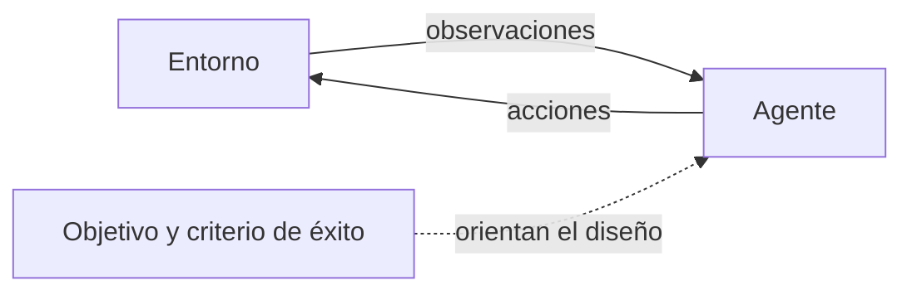
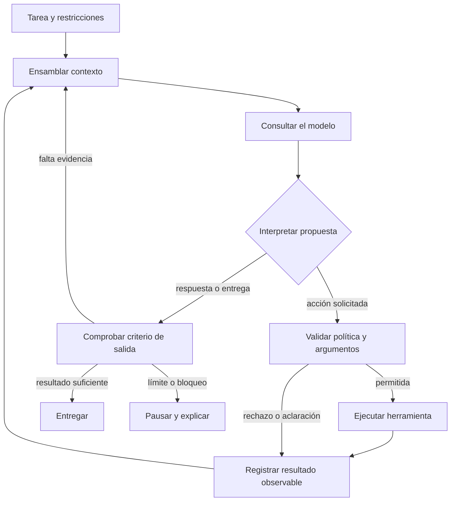
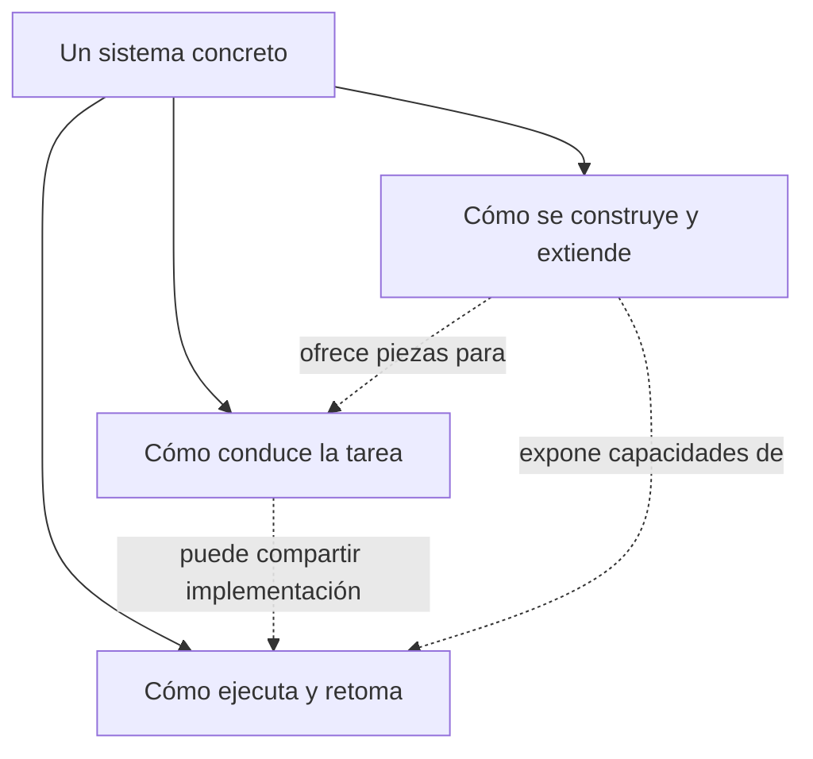
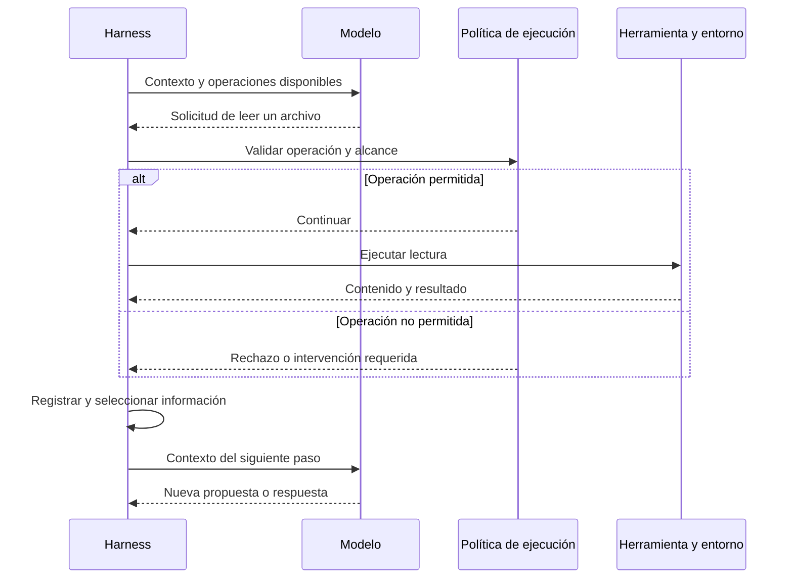
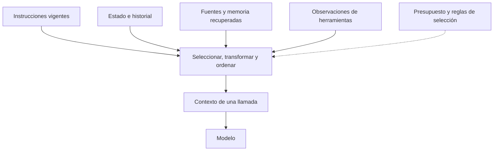
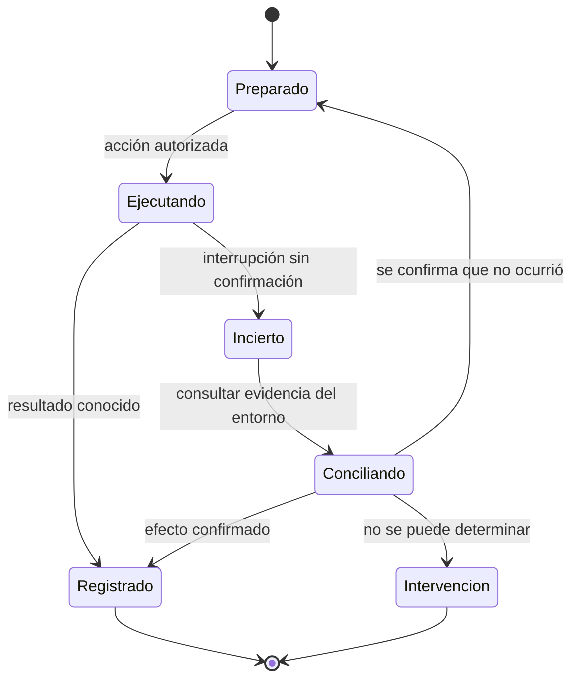
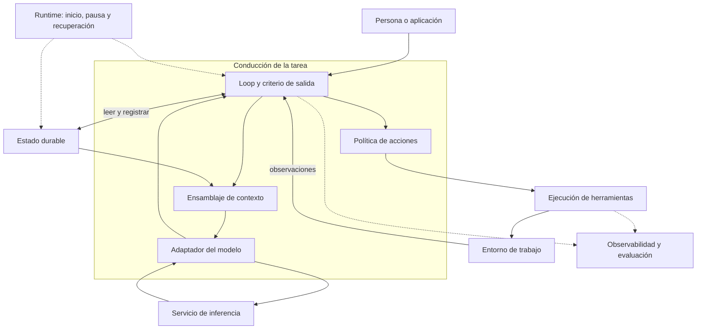
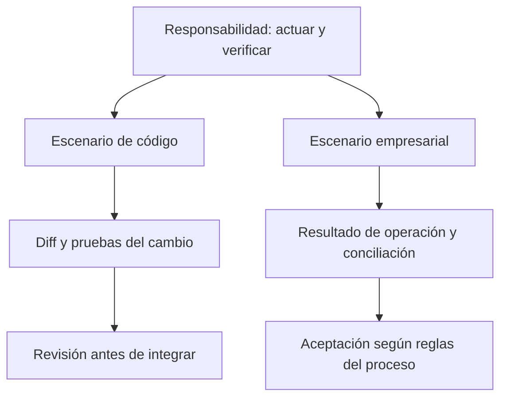
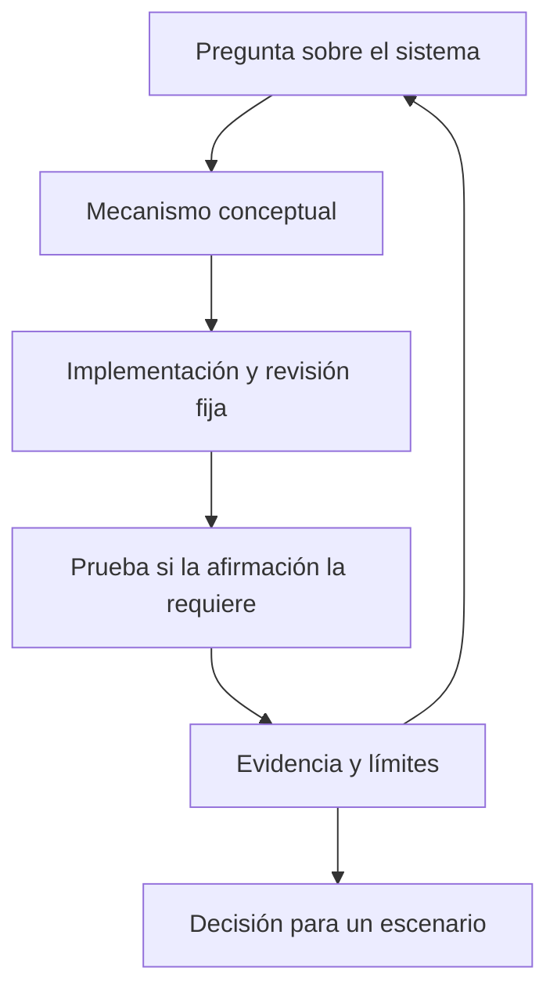

# Harness

Un **agent harness** es la composición de mecanismos y políticas que conduce el trabajo de un agente alrededor del modelo: prepara el contexto, expone herramientas, procesa las acciones solicitadas, incorpora sus resultados y controla la continuidad de la tarea. Esta es la definición de trabajo de la wiki; el alcance del término varía entre implementaciones.

El modelo participa en la elección del siguiente paso. El harness determina las condiciones de esa decisión y qué ocurre después: qué información estará disponible, qué acciones se admitirán, cómo se ejecutarán y qué evidencia permitirá continuar o detenerse. Cambiar esas condiciones modifica el comportamiento del sistema aunque se conserve el mismo modelo.

> Borrador. Definiciones y arquitecturas propias, con fuentes atribuidas en el texto. Implementación examinada: [Pi](../../tech/pi/README.md).

Como ejemplo, consideraremos un agente que modifica una función, ejecuta pruebas y entrega el cambio para revisión. Leer el código, decidir una edición, ejecutarla y verificarla son operaciones diferentes; el harness las conecta y conserva la información necesaria entre ellas.

## 1. Agente

En *Artificial Intelligence: A Modern Approach*, el agente se describe por su relación con el entorno: recibe percepciones y produce acciones. No requiere un LLM. Russell y Norvig distinguen además la función del agente del programa y la arquitectura que la realizan. Esto evita reducir «agente» a una categoría de productos recientes. [Fuente: capítulo 2, diapositiva 4](https://aima.cs.berkeley.edu/4th-ed/slides-pdf/chapter02.pdf#page=4).

**Figura 1 · Relación conceptual.** Las flechas continuas muestran interacción; la discontinua introduce el criterio con el que diseñamos y evaluamos el comportamiento. No representa necesariamente un mensaje al modelo.

En nuestro ejemplo, una observación puede ser un archivo o el resultado de una prueba; una acción puede ser leer, editar o ejecutar. El entorno incluye aquello con lo que interactúa el sistema, no solo una terminal.

Anthropic utiliza una distinción más específica para sistemas basados en LLM: en un workflow, el código predefine el recorrido; en un agente, el modelo participa en decidir los pasos y herramientas. Es una distinción sobre el control del recorrido. [Fuente: “What are agents?”](https://www.anthropic.com/engineering/building-effective-agents).

Un pipeline fijo puede ejecutar analizar → modificar → probar. Un recorrido más abierto puede decidir inspeccionar otro archivo después de un error. Ambos necesitan ejecución y estado; difieren en las decisiones que delegan al modelo. Un sistema puede combinar los dos.

Para describir esa delegación conviene precisar tres elementos: qué puede observar el agente, qué acciones tiene disponibles y qué decisiones conserva la aplicación. En el ejemplo, el modelo podría elegir los archivos que necesita leer, mientras una regla del proyecto exige revisión humana antes de integrar. La autonomía queda delimitada por esas decisiones concretas; disponer de herramientas no concede autoridad sobre todo el proceso.

## 2. Bucle del agente

El bucle conecta una decisión con la observación de su resultado. Cada iteración prepara una entrada al modelo, interpreta su respuesta y actualiza el estado con lo que efectivamente ocurrió. Si la respuesta solicita una herramienta, su resultado puede justificar otra llamada; si propone terminar, el sistema aplica su criterio de salida.

**Figura 2 · Flujo propuesto.** Los rombos son decisiones del sistema; pueden combinar lógica determinista, una evaluación y revisión humana. El dibujo no atribuye al LLM autoridad para aprobar sus propias acciones.

Una prueba fallida alimenta el contexto del siguiente intento. Un presupuesto agotado también puede detener el circuito, aunque la tarea esté incompleta. Debemos distinguir **fin de ejecución**, **éxito de la tarea** y **aceptación del resultado**. El agente puede terminar su turno y pasar pruebas sin que una persona haya aceptado el cambio.

La continuidad necesita una política explícita. Ante un error de compilación, puede ser útil volver al código con el diagnóstico. Ante un servicio inaccesible, otra llamada al modelo quizá no aporte información: corresponde esperar, reintentar bajo un límite o comunicar el bloqueo. El diseño debe evitar que cualquier fallo se traduzca en «volver a preguntar» sin cambiar las condiciones que lo produjeron.

**Planificación y orquestación** intervienen en este mismo circuito. Un plan representa pasos previstos y dependencias; la orquestación determina cuáles se ejecutan, en qué orden y con qué resultados de entrada. En nuestro ejemplo, «actualizar la función y después ejecutar sus pruebas» expresa una intención. Registrar que la edición terminó y habilitar la prueba correspondiente materializa esa dependencia. Si falla la prueba, el plan puede cambiar, pero el fallo observado debe conservarse para explicar la nueva decisión.

Delegar parte de la tarea a otro agente añade un contrato: objetivo, contexto entregado, operaciones permitidas y resultado esperado. El agente principal necesita incorporar la evidencia recibida y decidir si satisface su tarea. Multiplicar agentes no resuelve por sí mismo la gestión de dependencias, los errores o la aceptación del resultado.

El código de Pi ofrece un contraste concreto: su loop contempla herramientas, mensajes de dirección durante el trabajo, seguimientos posteriores y decisiones explícitas de continuación o fin. Se parece a este circuito, pero no ejecuta necesariamente todas sus comprobaciones. [Código: `runLoop`](https://github.com/earendil-works/pi/blob/b2b5c42f6138b73ec4b2f49ec0ca468800f88586/packages/agent/src/agent-loop.ts#L163).

## 3. Harness, runtime y framework

Para leer un sistema proponemos separar tres preguntas, aunque una biblioteca responda a varias:

| Pregunta | Responsabilidad que interesa inspeccionar |
|---|---|
| ¿Cómo se conduce la tarea? | Políticas de contexto, herramientas, continuidad y salida: el harness de nuestra definición de trabajo. |
| ¿Cómo se ejecuta y conserva el progreso? | Ciclo de ejecución, interrupciones, persistencia y recuperación: capacidades de runtime. |
| ¿Con qué piezas se construye? | Abstracciones, interfaces e integraciones: funciones de framework o SDK. |

LangChain distingue estos términos dentro de su ecosistema: LangGraph aporta runtime, LangChain las abstracciones del framework y Deep Agents un harness con capacidades preensambladas. Esta clasificación es del proveedor; no convierte «runtime → framework → harness» en un orden obligatorio para cualquier sistema. [Fuente: *Runtimes, frameworks, and harnesses*](https://docs.langchain.com/oss/python/concepts/products).

**Figura 3 · Mapa de responsabilidades.** Es una vista analítica, no una jerarquía de paquetes. Las conexiones discontinuas indican relaciones posibles, no dependencias obligatorias.

*Runtime* puede nombrar el proceso que ejecuta JavaScript, un motor de inferencia, un motor de workflows o el loop del agente. Antes de comparar dos runtimes, hay que identificar qué ejecutan, qué estado administran y qué contrato ofrecen al reanudar.

Aquí usamos *agent harness* para la composición alrededor del agente y *harness engineering* para el trabajo de diseñarla y evaluarla. *AI harness* requiere precisar su alcance en cada fuente. Estas son convenciones editoriales abiertas a contraste, no una normalización del vocabulario de toda la industria.

La distinción entre **mecanismo y política** permite abrir esa composición. Un mecanismo de compactación ofrece cómo resumir o retirar mensajes; la política determina cuándo hacerlo y qué información preservar. Un ejecutor ofrece concurrencia; la política decide qué operaciones pueden correr juntas. Un checkpoint permite guardar estado; la política establece en qué puntos hace falta y cómo se usa al recuperar. Un framework puede ofrecer esos mecanismos y un harness ensamblarlos con decisiones iniciales que la aplicación acepta o modifica.

Por eso un prompt es una parte del diseño. Puede comunicar objetivos y restricciones, pero la aplicación todavía debe implementar la selección de contexto, el despacho de herramientas y las transiciones de estado que esas instrucciones presuponen. Pedir «comprueba antes de entregar» y condicionar la entrega a un resultado verificable son decisiones diferentes de ingeniería.

## 4. Herramientas y ejecución

Una herramienta conecta una solicitud del modelo con una operación del entorno. Su descripción informa al modelo de cómo pedirla; su implementación valida los argumentos, ejecuta la operación y devuelve un resultado. La autorización debe resolverse en el punto donde el sistema controla el efecto.

**Figura 4 · Secuencia ilustrativa.** El modelo solicita; otro componente controla y ejecuta. La política podría implementarse en una función local o una infraestructura externa.

Hay tres objetos distintos: la solicitud generada, la acción realmente ejecutada y la evidencia que vuelve al circuito. Un mensaje que dice «la prueba pasó» no reemplaza el resultado de ejecutarla. Un timeout tampoco demuestra que una operación externa no ocurrió.

En esta propuesta, una herramienta de consulta debe expresar qué leyó y sus límites. Una herramienta que modifica un sistema también debe aclarar si produjo un efecto y cómo reconocerlo al recuperar la tarea. Esos contratos permiten una comparación más útil que una casilla genérica de «tools».

El contrato también debe distinguir resultado vacío, error de entrada y fallo de ejecución. «No se encontraron coincidencias» puede ser una observación válida; «el buscador no respondió» deja la consulta sin resolver. Si ambos se convierten en una cadena vacía, el siguiente paso parte de una interpretación incorrecta del entorno.

La concurrencia depende de las relaciones entre acciones. Leer dos archivos independientes puede ejecutarse en paralelo; probar una función después de editarla exige esperar a la edición. Dos modificaciones sobre el mismo archivo pueden entrar en conflicto aunque cada solicitud sea válida por separado. El despacho necesita conocer estas dependencias o aplicar una política conservadora cuando no pueda determinarlas.

## 5. Contexto

Un repositorio, un historial y una memoria persistente pueden contener información que el modelo no recibe en el siguiente paso. Separaremos el estado disponible de la representación seleccionada para una llamada.

**Figura 5 · Vista de datos propuesta.** Las flechas muestran aportaciones; no significan que se copie todo ni que todas las entradas tengan la misma autoridad.

Supongamos que una nota antigua indica «usar la API anterior» y se acaba de leer documentación de una versión nueva. Concatenar ambas no resuelve el conflicto. Nuestro diseño necesita conservar procedencia, vigencia y el motivo por el que una entrada se trata como instrucción, evidencia o antecedente.

El contexto también cambia con la fase de trabajo. Para localizar un error hacen falta el diagnóstico y el código relacionado; para revisar una solución importan el diff, los requisitos y los resultados de las pruebas. Mantener siempre los mismos fragmentos puede consumir presupuesto sin aportar lo que requiere la siguiente decisión. La selección debe seguir la tarea y conservar referencias a lo que quedó fuera.

Managed Agents ofrece un ejemplo concreto: Anthropic separa el registro durable de sesión de las transformaciones que el harness hace antes de la llamada. No es la única arquitectura posible. [Fuente: “The session is not Claude’s context window”](https://www.anthropic.com/engineering/managed-agents).

[Ensamblaje de contexto](context/context-assembly.md) abre este mecanismo. RAG aparece allí como una forma de aportar evidencia recuperada, no como sinónimo de toda la capa de contexto.

## 6. Estado y recuperación

Si el proceso cae después de aplicar un cambio pero antes de registrar la respuesta de la herramienta, repetir ciegamente puede duplicar una operación. El estado de conversación, el de ejecución y el estado real del entorno deben poder contrastarse.

**Figura 6 · Recuperación propuesta.** Terminar en intervención no significa completar la tarea. `Incierto` impide equiparar ausencia de respuesta con ausencia de efecto.

Para una edición local podríamos inspeccionar el diff. En un servicio externo podríamos necesitar un identificador de operación y una consulta de estado. Son decisiones del escenario, no garantías automáticas de un harness o una base de datos de mensajes.

Conviene separar tres registros. El **historial de conversación** conserva mensajes y resultados comunicados. El **estado de ejecución** identifica el paso activo, acciones pendientes y puntos de reanudación. El **estado del entorno** contiene los efectos reales: un archivo modificado o una operación aceptada por un servicio. Pueden divergir durante una interrupción; recuperar consiste en conciliarlos lo suficiente para decidir el siguiente paso.

Guardar un checkpoint antes de una acción permite conocer la intención, pero no confirma su efecto. Guardarlo después registra el resultado conocido, aunque sigue existiendo un intervalo entre el efecto y su registro. Para acciones repetibles puede bastar una nueva ejecución; para otras habrá que consultar el estado o utilizar un mecanismo de deduplicación que el servicio realmente soporte. La política se decide por operación, no solo por la existencia de persistencia.

LangGraph distingue checkpoints del estado de un thread y stores para datos entre threads. Advierte también que un checkpointer en memoria pierde datos al reiniciar el proceso. «Tiene persistencia» es una afirmación incompleta sin el backend y el alcance. [Fuente: *Persistence*](https://docs.langchain.com/oss/python/langgraph/persistence).

## 7. Arquitectura

Esta arquitectura propuesta reúne el bucle, el ensamblaje de contexto, el acceso al modelo, la ejecución y el estado durable. Las responsabilidades pueden implementarse en un proceso o distribuirse entre varios.

**Figura 7 · Arquitectura de responsabilidades propuesta.** Flechas continuas: intercambio o ejecución. Discontinuas: soporte del ciclo de vida o emisión de señales. No es una vista de despliegue: una caja no equivale a un microservicio. Las fronteras de confianza y el aislamiento requieren otra vista específica.

El adaptador del modelo traduce el contrato interno de mensajes y herramientas a la interfaz de inferencia. El bucle consume su respuesta y decide cómo tratarla; el ejecutor produce efectos en el entorno; el registro de estado sostiene la continuidad. Cambiar un proveedor exige revisar las diferencias que el adaptador puede absorber y las que afectan al comportamiento, como los formatos admitidos o las condiciones de finalización.

Observabilidad recoge señales; evaluación las contrasta con un criterio. Una traza completa puede mostrar una llamada correcta sin demostrar que resolvió la necesidad del usuario. En nuestro ejemplo necesitamos revisar las pruebas y el alcance del cambio entregado.

Una traza útil para este escenario enlazaría la solicitud de la persona, la selección de archivos, la propuesta de edición, el efecto producido y la comprobación posterior. La evaluación preguntaría si se mantuvo la API pública, si la prueba cubre el fallo y si aparecieron cambios ajenos al alcance. La primera permite reconstruir lo ocurrido; la segunda valora ese comportamiento con requisitos explícitos.

Operar esta arquitectura abre despliegue, coste, incidentes y evolución. No los asignamos aquí a una definición cerrada de AIOps: distinguiremos el uso de IA para operaciones del trabajo de operar sistemas de IA antes de desarrollar ese recorrido.

## 8. Escenarios

La comparación útil conserva la responsabilidad y cambia las condiciones del entorno.

**Figura 8 · Comparación de escenarios propuesta.** No clasifica productos. Un agente de código también puede causar efectos externos, y uno empresarial puede trabajar solo con borradores.

| Dimensión | Cambio en un repositorio de prueba | Operación en un sistema empresarial |
|---|---|---|
| Evidencia de progreso | Diff, pruebas y artefactos | Estado de operación y resultado de negocio |
| Recuperación | Inspeccionar cambios y rehacer pasos seguros | Conciliar efectos y evitar duplicados |
| Salida del agente | Propuesta verificable | Resultado o excepción identificados |
| Aceptación | Revisión según el flujo del proyecto | Decisión según las reglas del proceso |

Esta tabla es un instrumento de diseño. No mide rendimiento ni permite afirmar que una tecnología sea mejor sin fijar tarea, versión, configuración y evidencia.

## 9. Evaluación

La evaluación necesita una pregunta acotada. Para comparar políticas de contexto, por ejemplo, podemos fijar tarea, modelo, herramientas e historial y cambiar la selección de mensajes. Así podremos observar qué información llega a la llamada y qué consecuencias tiene en el resultado. Cambiar simultáneamente modelo, herramientas y política dificulta atribuir la diferencia a una causa.

**Figura 9 · Recorrido de investigación propuesto.** Las flechas son pasos del estudio, no llamadas del agente. Leer código sustenta afirmaciones sobre esa implementación; una prueba sustenta lo observado bajo sus condiciones. Ninguna convierte por sí sola una preferencia en recomendación universal.

Esta entrega conecta [el ensamblaje de contexto](context/context-assembly.md) y [su recorrido en Pi](../../tech/pi/README.md). MAF y otras implementaciones podrán contrastarse con las mismas preguntas cuando se inspeccionen sus revisiones. El concepto puede madurar sin reconstruir toda la explicación cada vez que un producto cambia.
