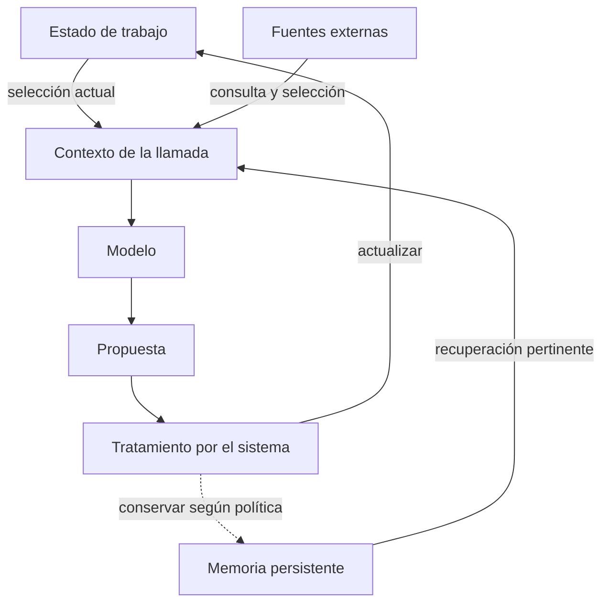
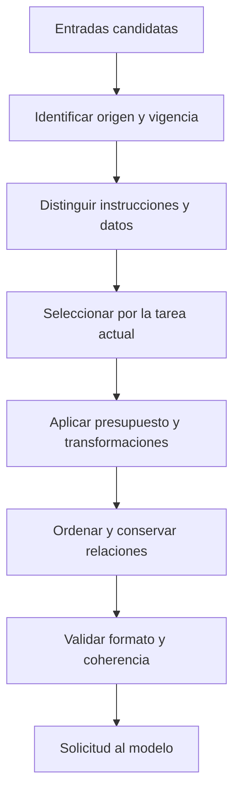
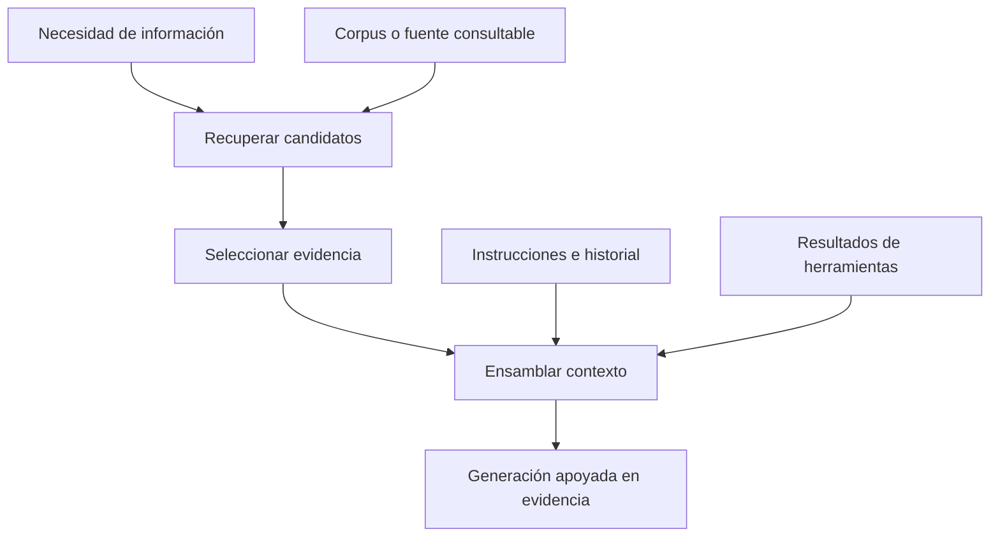
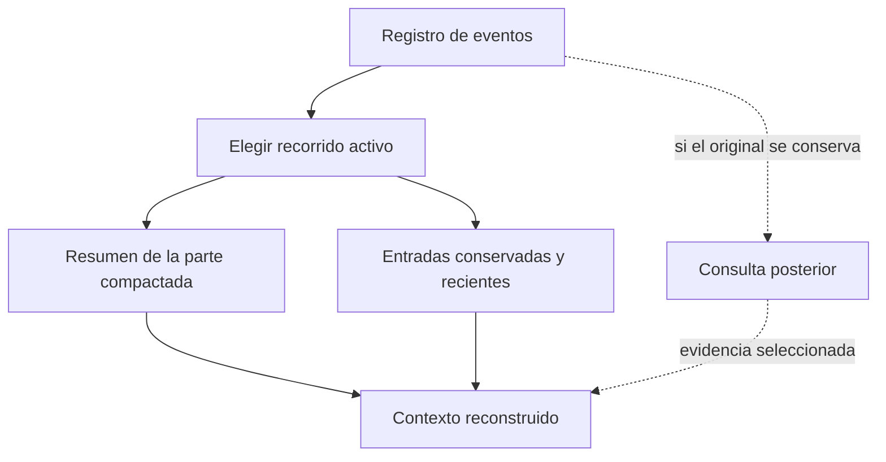
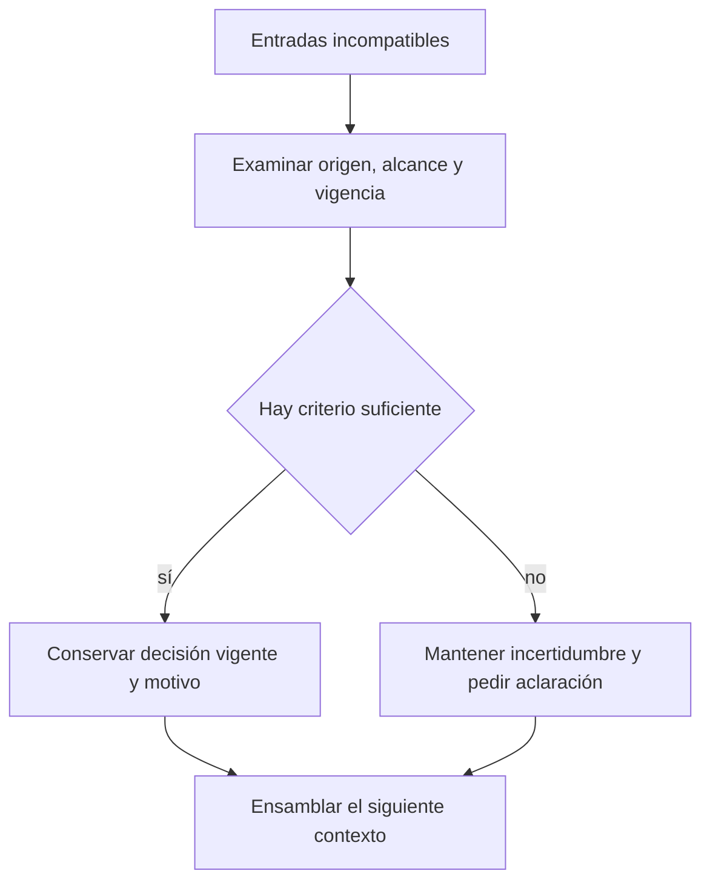

# Ensamblaje de contexto: construir la siguiente llamada

El agente que modifica una función puede acceder a cientos de archivos, una conversación larga y resultados de herramientas. El modelo recibe una representación delimitada para decidir el siguiente paso. **Ensamblar contexto es construir esa representación**: decidir qué entra, con qué papel, qué se transforma y qué queda disponible para recuperar después.

> Borrador para revisión. Las figuras son modelos propios de diseño. La implementación de Pi se identifica por separado. No se ha ejecutado un experimento de calidad o rendimiento.

## 1. Tres objetos que parecen el mismo

Llamemos **estado de trabajo** a la información con la que el sistema conduce la tarea, **memoria persistente** a lo que conserva con un alcance definido y **contexto de la llamada** a lo que entrega al modelo en ese paso. Pueden solaparse, pero responden a preguntas diferentes.

**Figura 1 · Relaciones de datos.** Generar una frase no significa que se haya convertido automáticamente en memoria válida: el retorno pasa por el sistema.

La distinción entre memoria de corto y largo plazo necesita un alcance. En LangGraph, checkpoints se asocian con un thread y stores con datos entre threads. No implica que toda memoria corta viva en RAM o toda memoria larga sea una base vectorial. [Fuente: *Persistence*](https://docs.langchain.com/oss/python/langgraph/persistence).

«Hay una edición pendiente» es estado de tarea; «este proyecto requiere pruebas antes de integrar» puede ser una instrucción persistente; el fragmento que se modificará forma parte del contexto actual. Guardarlos juntos no elimina esas diferencias.

## 2. Assemble implica preservar significado

Este pipeline ordena decisiones para explicarlas. Una implementación puede combinarlas o repetirlas.

**Figura 2 · Pipeline conceptual propuesto.** Las etapas son responsabilidades, no APIs. Cada transformación debería poder explicarse: qué conservó, qué excluyó y qué relación necesitaba mantener.

Un resultado de herramienta sin la solicitud que le da sentido puede perder coherencia o incumplir el formato del proveedor. Copiar una página web al bloque de instrucciones borra la distinción entre una fuente consultada y una orden del usuario. Para este diseño son errores de ensamblaje, aunque el texto quepa en la ventana.

Anthropic propone combinar información inicial con recuperación bajo demanda y trata compactación y notas persistentes como recursos para tareas largas. Aquí son antecedentes; el pipeline y sus criterios de autoridad son nuestra propuesta de análisis. [Fuente: *Effective context engineering for AI agents*](https://www.anthropic.com/engineering/effective-context-engineering-for-ai-agents).

## 3. Dónde entra RAG

Usamos RAG para referirnos a generación apoyada en información recuperada. El trabajo de Lewis y colaboradores combina memoria paramétrica y recuperación sobre memoria externa; aquí abstraemos ese mecanismo sin reproducir su arquitectura experimental. [Antecedente: resumen de RAG](https://arxiv.org/abs/2005.11401). La recuperación aporta material; el ensamblaje decide cómo usarlo junto a instrucciones, observaciones e historial.

**Figura 3 · Una composición posible.** No prescribe embeddings ni una base vectorial. La fuente podría ser un buscador o una consulta estructurada. Tampoco convierte toda lectura de memoria en un sistema RAG completo.

Para modificar una API, el agente podría recuperar documentación de una versión y cargar después el archivo. La arquitectura debe explicar por qué eligió esa versión y qué hizo si la documentación contradijo el código. «Se hizo retrieval» no contesta esas preguntas.

## 4. El presupuesto expresa una elección

Una desigualdad ayuda a hacer explícito el problema:

`instrucciones + historial seleccionado + evidencia + resultados + descripciones de herramientas + reserva de salida ≤ capacidad utilizable`.

Es un modelo contable, no una fórmula exacta del proveedor. Tokenización, formato y límites dependen del modelo y su API. No asignamos porcentajes universales.

Excluir una salida repetida puede ser razonable; excluir «no modificar la API pública» cambia la tarea. Antes de optimizar tokens proponemos identificar invariantes: requisitos vigentes, decisiones pendientes y evidencia necesaria para justificar el próximo paso.

| Decisión propuesta | Qué conserva | Qué puede perder |
|---|---|---|
| Fragmento literal | Detalle verificable | Espacio para otra información |
| Resumen | Idea general y referencias, si se incluyen | Matices u obligaciones omitidas |
| Localizador | Posibilidad de recuperar el original | Acceso inmediato al contenido |
| Exclusión | Presupuesto disponible | Información luego relevante |

No hemos medido estos efectos. La tabla delimita lo que una prueba deberá observar.

## 5. Compactar, conservar y reconstruir

Hay que preguntar por separado qué quedó almacenado y qué quedó visible para el modelo.

**Figura 4 · Reconstrucción propuesta.** La línea discontinua depende de la política de conservación. Un resumen no permite reconstruir fielmente todo lo omitido.

En Pi, `buildContextEntries` selecciona el recorrido activo y la compactación más reciente; `buildSessionProjection` construye mensajes desde esas entradas y aplica ediciones de contexto; `buildSessionContext` devuelve la proyección final. Una rama alternativa del árbol de sesión no equivale a contexto activo. [Código examinado: `session-manager.ts`](https://github.com/earendil-works/pi/blob/b2b5c42f6138b73ec4b2f49ec0ca468800f88586/packages/coding-agent/src/core/session-manager.ts#L477).

Eso demuestra una transformación implementada, no la calidad de los resúmenes ni su efecto sobre el desempeño. [Pi](../../../tech/pi/README.md) muestra cómo esa proyección se conecta con la llamada.

## 6. Un conflicto que conviene poder explicar

Un resumen antiguo dice «usar versión A», pero el usuario acaba de pedir versión B. Este flujo propone cómo tratarlo; no corresponde a una política probada en Pi.

**Figura 5 · Resolución propuesta.** «Más reciente» no basta: una instrucción encontrada en una web no tiene por eso autoridad sobre la tarea.

Una prueba pequeña podría fijar el historial y comparar dos políticas de selección. Observaríamos qué requisitos llegan a la llamada y qué se pierde; después evaluaríamos sus consecuencias sobre respuestas o acciones. Esta entrega no ejecuta llamadas a modelos ni presenta resultados de ese experimento.

El siguiente paso es seguir [la preparación de mensajes en Pi](../../../tech/pi/README.md): reconstrucción del estado, intervención de extensiones y adaptación al proveedor. Así el mecanismo puede contrastarse con una implementación sin confundirse con ella.
