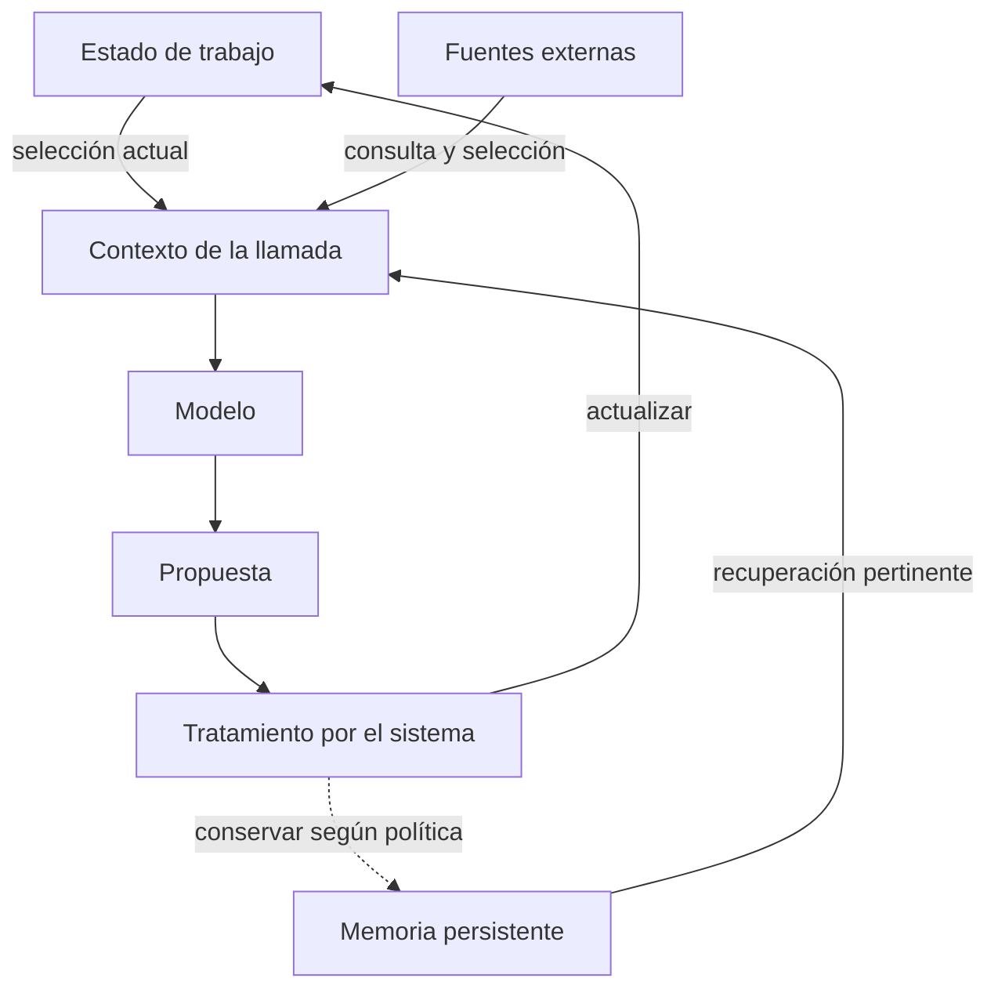
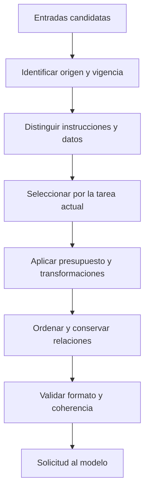
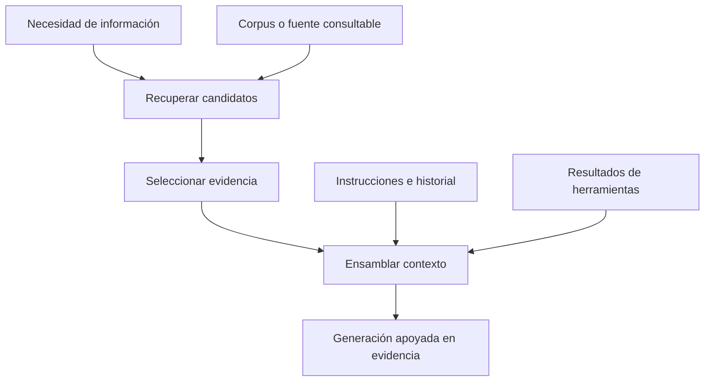
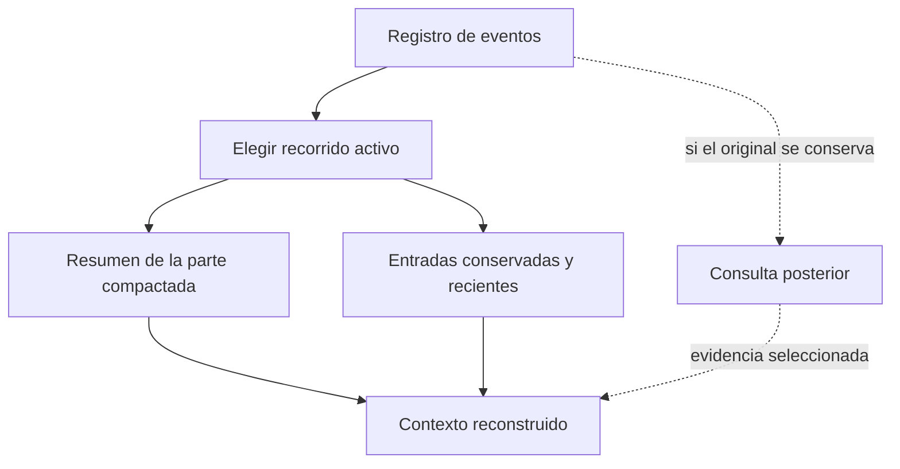
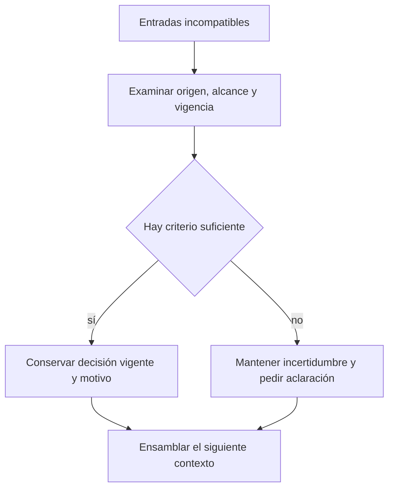

# Ensamblaje de contexto

**Ensamblar contexto** consiste en seleccionar, transformar y ordenar la información que se entrega al modelo en una llamada. Incluye instrucciones, historial, resultados de herramientas y material recuperado. Cada entrada tiene un origen y una función: orientar el comportamiento, describir el estado de la tarea o aportar evidencia para una decisión.

El agente que modifica una función puede acceder a cientos de archivos y a una conversación larga. La llamada necesita un conjunto delimitado: la petición vigente, el código pertinente, las restricciones de edición y los resultados que justifican el siguiente paso. El ensamblaje convierte esa información disponible en una entrada concreta; la selección puede cambiar en cada iteración.

> Borrador. Pipeline y figuras propuestos; implementación de Pi identificada por commit. Sin mediciones de calidad o rendimiento.

## 1. Estado, memoria y contexto

Llamemos **estado de trabajo** a la información con la que el sistema conduce la tarea, **memoria persistente** a lo que conserva con un alcance definido y **contexto de la llamada** a lo que entrega al modelo en ese paso. Pueden solaparse, pero responden a preguntas diferentes.

**Figura 1 · Relaciones de datos.** Generar una frase no significa que se haya convertido automáticamente en memoria válida: el retorno pasa por el sistema.

La distinción entre memoria de corto y largo plazo necesita un alcance. En LangGraph, checkpoints se asocian con un thread y stores con datos entre threads. No implica que toda memoria corta viva en RAM o toda memoria larga sea una base vectorial. [Fuente: *Persistence*](https://docs.langchain.com/oss/python/langgraph/persistence).

«Hay una edición pendiente» es estado de tarea; «este proyecto requiere pruebas antes de integrar» puede ser una instrucción persistente; el fragmento que se modificará forma parte del contexto actual. Guardarlos juntos no elimina esas diferencias.

La memoria requiere decisiones de escritura y lectura. Primero se decide qué merece conservarse, con qué procedencia y durante cuánto tiempo. Después se decide cuándo recuperarlo y cómo usarlo. Una conclusión de una sesión anterior puede ser útil como antecedente, pero necesita contrastarse si cambió la versión del proyecto o el requisito que la originó. Persistir una conclusión no la vuelve vigente indefinidamente.

Para describir memoria de corto y largo plazo proponemos especificar **alcance**, **duración** y **representación**. El alcance puede ser un turno, una sesión, un proyecto o un usuario; la duración indica cuándo caduca o se revisa; la representación puede ser un mensaje, una nota o un registro estructurado. Esta descripción permite entender qué se comparte entre tareas y qué permanece aislado, sin inferirlo únicamente de las etiquetas *short-term* y *long-term*.

## 2. Proceso de ensamblaje

Este pipeline ordena decisiones para explicarlas. Una implementación puede combinarlas o repetirlas.

**Figura 2 · Pipeline conceptual propuesto.** Las etapas son responsabilidades, no APIs. Cada transformación debería poder explicarse: qué conservó, qué excluyó y qué relación necesitaba mantener.

Un resultado de herramienta sin la solicitud que le da sentido puede perder coherencia o incumplir el formato del proveedor. Copiar una página web al bloque de instrucciones borra la distinción entre una fuente consultada y una orden del usuario. Para este diseño son errores de ensamblaje, aunque el texto quepa en la ventana.

En el ejemplo de edición, identificar el origen permite separar la petición actual, las reglas del repositorio y la documentación consultada. Seleccionar por relevancia permite incluir la función afectada y su prueba, dejando otros módulos disponibles mediante referencias. Aplicar el presupuesto puede requerir recortar un log repetitivo; ordenar exige mantener la relación entre comando, resultado y decisión posterior. La validación final comprueba que el conjunto conserva esas relaciones y el formato esperado.

Las transformaciones no son intercambiables. **Filtrar** elimina candidatos; **resumir** cambia su representación; **deduplicar** evita repetir información equivalente; **ordenar** establece su ubicación y relaciones dentro de la solicitud. Un resumen generado antes de resolver un conflicto puede incorporar una decisión obsoleta. Deduplicar dos fragmentos casi iguales puede borrar una diferencia de versión. La implementación necesita conservar los atributos que permiten distinguirlos antes de comprimir el contenido.

Anthropic propone combinar información inicial con recuperación bajo demanda y trata compactación y notas persistentes como recursos para tareas largas. Aquí son antecedentes; el pipeline y sus criterios de autoridad son nuestra propuesta de análisis. [Fuente: *Effective context engineering for AI agents*](https://www.anthropic.com/engineering/effective-context-engineering-for-ai-agents).

## 3. Recuperación y RAG

Usamos RAG para referirnos a generación apoyada en información recuperada. El trabajo de Lewis y colaboradores combina memoria paramétrica y recuperación sobre memoria externa; aquí abstraemos ese mecanismo sin reproducir su arquitectura experimental. [Antecedente: resumen de RAG](https://arxiv.org/abs/2005.11401). La recuperación aporta material; el ensamblaje decide cómo usarlo junto a instrucciones, observaciones e historial.

**Figura 3 · Una composición posible.** No prescribe embeddings ni una base vectorial. La fuente podría ser un buscador o una consulta estructurada. Tampoco convierte toda lectura de memoria en un sistema RAG completo.

Para modificar una API, el agente podría recuperar documentación de una versión y cargar después el archivo. La arquitectura debe explicar por qué eligió esa versión y qué hizo si la documentación contradijo el código. «Se hizo retrieval» no contesta esas preguntas.

En este diseño, la recuperación empieza con una necesidad concreta: la firma de una función, una decisión previa o una restricción del proyecto. El resultado devuelve candidatos con localizadores y versión cuando corresponda. El ensamblaje decide cuáles son pertinentes, si necesitan contexto adicional y cómo citarlos en la llamada. Un fragmento que describe otra versión puede ser una coincidencia textual excelente y una evidencia inadecuada para la tarea.

La recuperación también puede ser iterativa. El primer fragmento identifica un símbolo; una lectura posterior abre su implementación y otra consulta localiza sus pruebas. El harness puede conservar localizadores y traer contenido cuando haga falta, en vez de cargar desde el inicio todo el repositorio. Esa elección cambia el número de consultas y el volumen de contexto; su conveniencia debe evaluarse con tareas representativas.

## 4. Presupuesto de contexto

Una desigualdad ayuda a hacer explícito el problema:

`instrucciones + historial seleccionado + evidencia + resultados + descripciones de herramientas + reserva de salida ≤ capacidad utilizable`.

Es un modelo contable, no una fórmula exacta del proveedor. Tokenización, formato y límites dependen del modelo y su API. No asignamos porcentajes universales.

Excluir una salida repetida puede ser razonable; excluir «no modificar la API pública» cambia la tarea. Antes de optimizar tokens proponemos identificar invariantes: requisitos vigentes, decisiones pendientes y evidencia necesaria para justificar el próximo paso.

| Decisión propuesta | Qué conserva | Qué puede perder |
|---|---|---|
| Fragmento literal | Detalle verificable | Espacio para otra información |
| Resumen | Idea general y referencias, si se incluyen | Matices u obligaciones omitidas |
| Localizador | Posibilidad de recuperar el original | Acceso inmediato al contenido |
| Exclusión | Presupuesto disponible | Información luego relevante |

Si un resultado excede el presupuesto, la aplicación puede guardar el original y entregar un fragmento con su localizador. Para depurar una excepción interesan el mensaje de error y los marcos relacionados; para comprobar una búsqueda negativa importa saber qué ámbito se consultó. Recortar siempre los primeros caracteres puede eliminar precisamente la evidencia necesaria. La política debe relacionar el recorte con el tipo de resultado y conservar la posibilidad de ampliarlo.

Estas son alternativas de diseño; sus efectos sobre la calidad requieren medición. Una comprobación previa puede verificar si los requisitos y localizadores siguen presentes, antes de evaluar la respuesta del modelo.

## 5. Compactación y reconstrucción

Hay que preguntar por separado qué quedó almacenado y qué quedó visible para el modelo.

**Figura 4 · Reconstrucción propuesta.** La línea discontinua depende de la política de conservación. Un resumen no permite reconstruir fielmente todo lo omitido.

Compactar sustituye parte del material visible por una representación más breve. Para continuar una tarea, el resumen debería conservar objetivo vigente, restricciones, decisiones tomadas, evidencia relevante y asuntos pendientes. Una narración cronológica de todo lo ocurrido puede ocupar menos espacio y aun así omitir qué falta resolver. La estructura del resumen debe responder al uso que tendrá en el siguiente turno.

Conservar el original permite revisar una omisión, siempre que exista un localizador y una vía de recuperación. Si solo queda el resumen, lo perdido deja de estar disponible para ese sistema. Por eso la política de compactación y la política de conservación se diseñan por separado: reducir lo que ve el modelo no exige necesariamente borrar el registro persistido.

En Pi, `buildContextEntries` selecciona el recorrido activo y la compactación más reciente; `buildSessionProjection` construye mensajes desde esas entradas y aplica ediciones de contexto; `buildSessionContext` devuelve la proyección final. Una rama alternativa del árbol de sesión no equivale a contexto activo. [Código examinado: `session-manager.ts`](https://github.com/earendil-works/pi/blob/b2b5c42f6138b73ec4b2f49ec0ca468800f88586/packages/coding-agent/src/core/session-manager.ts#L477).

Eso demuestra una transformación implementada, no la calidad de los resúmenes ni su efecto sobre el desempeño. [Pi](../../../tech/pi/README.md) muestra cómo esa proyección se conecta con la llamada.

## 6. Conflictos y vigencia

Un resumen antiguo dice «usar versión A», pero el usuario acaba de pedir versión B. Este flujo propone cómo tratarlo; no corresponde a una política probada en Pi.

**Figura 5 · Resolución propuesta.** «Más reciente» no basta: una instrucción encontrada en una web no tiene por eso autoridad sobre la tarea.

En el ejemplo, la instrucción actual de usar B reemplaza la preferencia anterior por A. El contexto siguiente debe conservar esa decisión y seleccionar documentación de B. El resumen antiguo puede mantenerse como antecedente identificado, pero no como instrucción activa. Si el código instalado sigue usando A, esa observación añade una discrepancia que resolver: quizá la tarea incluya una migración o quizá falte aclarar su alcance. El ensamblaje debe conservar la discrepancia cuando aún no existe una decisión suficiente.

Una prueba pequeña podría fijar el historial y comparar dos políticas de selección. Observaríamos qué requisitos llegan a la llamada y qué se pierde; después evaluaríamos sus consecuencias sobre respuestas o acciones. Esta entrega no ejecuta llamadas a modelos ni presenta resultados de ese experimento.

El siguiente paso es seguir [la preparación de mensajes en Pi](../../../tech/pi/README.md): reconstrucción del estado, intervención de extensiones y adaptación al proveedor. Así el mecanismo puede contrastarse con una implementación sin confundirse con ella.
