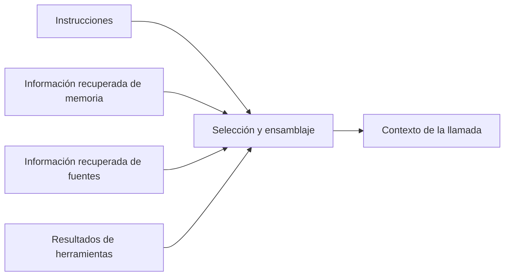

# Ensamblaje de contexto

Pregunta del piloto: **¿cómo se selecciona, transforma y ordena la información que recibe el modelo en el siguiente paso?** Queremos explicar el mecanismo y después examinar una implementación con su revisión identificada.

## Muestra visual para discutir

El siguiente esquema es una hipótesis de organización del estudio, no la arquitectura verificada de un producto.

## Preguntas de profundización

¿Qué entradas intervienen y con qué prioridad? ¿Qué se transforma o descarta? ¿Cómo se relaciona con memoria y estado? ¿Qué cambia cuando una tarea abarca varias sesiones? ¿Cómo observaríamos el resultado en una prueba pequeña?

## Siguiente paso

Verificar el alcance con fuentes primarias, delimitar una demostración y contrastar con [Pi](../../../tech/pi/README.md). Iterar la explicación y este diagrama antes de fijar su plantilla. Todavía no se ha ejecutado una prueba ni completado la revisión técnica.
