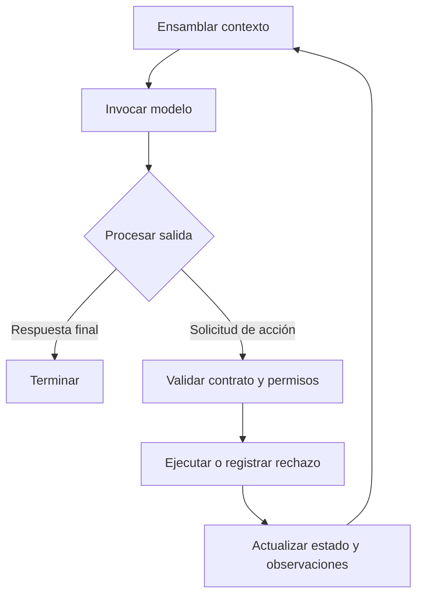
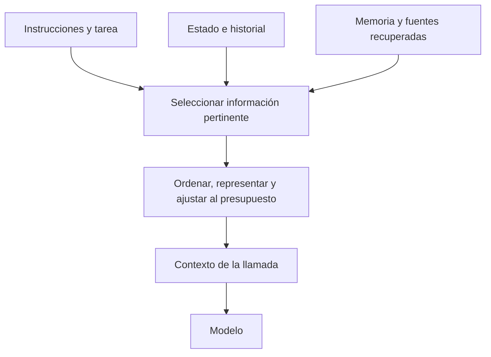

# Piloto editorial

Estado: `in-review`. Actualizado: 2026-10-05. Aceptación editorial pendiente.

## Formato y tono

Esta iteración utiliza Markdown como fuente de lectura y revisión: prosa, tablas, un esquema textual y dos diagramas Mermaid. El HTML puede generarse automáticamente para visualizar el mismo contenido. La composición manual en Draw.io se reserva para las figuras que Jairzinho seleccione después de revisar su contenido.

| Formato | Trabajo adicional durante la iteración | Uso propuesto |
|---|---|---|
| Markdown | Poco marcado; revisión del texto y las relaciones. | Fuente del artículo en GitHub. |
| Mermaid dentro del Markdown | Describir nodos y relaciones; comprobar renderizado. | Flujos y mecanismos con composición sencilla. |
| HTML/CSS escrito a medida | Estructura, estilos, adaptación de pantalla y pruebas visuales. | Solo cuando haya una necesidad de interfaz. |
| Draw.io con SVG/PNG | Composición, fuente editable, exportación y comprobación visual. | Figuras seleccionadas que necesiten más control. |

La comparación es cualitativa, para un contenido equivalente; no es una medición de tokens de la sesión. El ahorro esperado proviene de reducir marcado generado y vueltas de maquetación. La investigación y el desarrollo de la explicación siguen siendo necesarios. Convertir Markdown a HTML con un programa no requiere que el modelo vuelva a redactarlo; revisar o modificar ese resultado sí puede consumir tokens adicionales. El tamaño en bytes de los archivos no mide ese consumo.

La dirección de tono toma como referencia la separación de responsabilidades en [OpenAI](https://developers.openai.com/api/docs/guides/agents/sandboxes) y las distinciones operativas de [LangGraph](https://docs.langchain.com/oss/python/langgraph/persistence): definición, mecanismo, condiciones y consecuencias. Se busca prosa técnica de revisión, con afirmaciones delimitadas y fuentes próximas. La muestra es una síntesis documental; no presenta resultados experimentales propios.

## Comparación de definiciones

La [revisión de 27 proyectos y perspectivas de sus autores](../benchmarks/2026-10-harness-definitions/README.md) amplía la base conceptual a Anthropic y proyectos abiertos. Conserva divergencias, distingue autodescripciones de definiciones y propone una síntesis pendiente de decisión. La muestra siguiente sigue provisional.

## Muestra propuesta

<!-- tone-sample:start -->
# Harness

Un **harness de IA** es el andamiaje de software que rodea a un modelo y organiza su interacción con información, herramientas y entorno. En un sistema agéntico, sostiene el ciclo de ejecución: prepara el contexto, invoca el modelo, procesa sus solicitudes de acción y conserva la información necesaria para continuar. Esta definición adopta el alcance descrito por OpenAI para el sistema de ejecución que acompaña al modelo. [1]

Un [modelo de lenguaje grande](../concepts/models/language-models.md), en su formulación autorregresiva, genera tokens condicionados por la secuencia previa. Una solicitud de herramienta forma parte de esa salida; ejecutar la operación requiere software que la interprete. La distinción sitúa el harness en la relación entre generación y efectos sobre el entorno. La fiabilidad y la escalabilidad dependen de cómo se implemente y evalúe esa relación. [2, 3]

## Alcance

El término *harness* no identifica una arquitectura única. OpenAI lo describe como el plano de control que gestiona el bucle, las llamadas al modelo, las herramientas y el estado de ejecución. LangChain utiliza *agent harness* para conjuntos de capacidades ya integradas, como planificación, sistema de archivos y delegación. Ambos usos describen software alrededor del modelo, pero delimitan el conjunto desde perspectivas diferentes. [3, 4]

Para analizar un sistema se propone distinguir cinco responsabilidades:

```text
Harness
├── Contexto       Información preparada para cada llamada
├── Control        Continuación, delegación y terminación
├── Acciones       Herramientas, permisos y resultados
├── Continuidad    Estado, persistencia y recuperación
└── Inspección     Trazas y evidencia para evaluación
```

*Figura 1. Agrupación analítica propia a partir de [1, 3, 4]. El árbol organiza responsabilidades; no prescribe módulos, servicios ni capas independientes. El modelo es el componente invocado por el harness.*

Una implementación puede reunir varias responsabilidades en un mismo componente. La recuperación de documentos, por ejemplo, puede ejecutarse como herramienta y aportar información al ensamblaje de contexto. Del mismo modo, una aprobación humana puede suspender el control y exigir que se conserve el estado. Estas relaciones impiden clasificar cada capacidad como una caja aislada.

## Ciclo de ejecución

La unidad relevante para el análisis es la interacción completa entre una llamada al modelo y sus consecuencias. El harness determina la entrada disponible, interpreta la respuesta y decide cómo continuar dentro de las reglas de la aplicación. El modelo puede proponer una acción; su ejecución depende de los contratos y permisos del sistema. OpenAI separa explícitamente este control del entorno de cómputo donde se ejecutan comandos o se modifican archivos. [3]



*Figura 2. Ciclo simplificado, síntesis propia basada en [1, 3]. Las flechas indican orden de control. Se omiten delegación, pausas y concurrencia para aislar la relación entre generación, ejecución y nueva observación.*

Considérese un agente que corrige una función. Una llamada identifica el archivo que necesita leer; la herramienta devuelve su contenido. La siguiente llamada puede proponer una modificación y otra solicitar una prueba. Cada resultado altera la información disponible para decidir el paso posterior. Este es un ejemplo conceptual de diseño, no una ejecución medida.

También hacen falta criterios de terminación fuera de la respuesta final: presupuesto agotado, cancelación o imposibilidad de continuar. Repetir el ciclo no demuestra progreso. Una política de control debe poder distinguir una observación nueva de la repetición de un error y registrar por qué se detuvo el trabajo. Esos criterios forman parte de la propuesta de diseño de esta wiki.

## Contexto, estado y memoria

El **contexto** es la información entregada al modelo en una llamada. El **estado** comprende los datos que permiten seguir la ejecución. La **memoria** conserva información para recuperarla según un alcance definido. Estas categorías pueden solaparse en una implementación: una conversación puede pertenecer al estado persistido y aportar solo una parte de la entrada del modelo. Anthropic describe la preparación del contexto como una selección iterativa entre las fuentes disponibles. [5]

El **ensamblaje de contexto** convierte esas fuentes en una entrada concreta. Incluye selección, representación, orden y ajuste al presupuesto disponible. La siguiente figura propone una descomposición del proceso; no implica que exista una única función que lo ejecute.



*Figura 3. Flujo de información propuesto a partir de [5]. Las flechas muestran aportes y transformaciones; no una jerarquía de autoridad entre las fuentes.*

En el ejemplo de corrección de código, el estado puede conservar el archivo modificado, el resultado de la prueba y la acción pendiente. La siguiente llamada necesita el fallo pertinente y el fragmento afectado; no necesariamente todos los resultados de búsqueda anteriores. Una decisión conservada entre sesiones puede incorporarse si afecta la modificación actual. El criterio propuesto es seleccionar información por su función en la siguiente decisión.

LangGraph concreta parte de esta separación mediante *checkpointers*, que conservan el estado de un hilo, y *stores*, que permiten mantener datos entre hilos. Persistir información no decide automáticamente qué debe recibir el modelo: esa selección sigue siendo parte del diseño de la aplicación. [6]

El detalle se desarrolla en [Ensamblaje de contexto](../concepts/harness/context/context-assembly.md), donde se distinguen recuperación, compactación y continuidad entre llamadas.

## Runtime y framework

En la terminología de LangChain, un **runtime** aporta mecanismos de ejecución y continuidad; un **framework** ofrece abstracciones e integraciones para construir aplicaciones; un **harness** reúne capacidades y decisiones de funcionamiento ya configuradas. LangGraph participa como runtime y framework de orquestación. Estas categorías describen responsabilidades y niveles de integración; no son conjuntos mutuamente excluyentes de productos. [4]

Conviene precisar también qué se entiende por entorno de ejecución. Un runtime agéntico puede coordinar pausas y reanudaciones, mientras un sandbox proporciona un entorno para ejecutar herramientas. La separación permite estudiar, por ejemplo, qué estado conserva la aplicación si desaparece el proceso que ejecutaba una acción. [3, 4]

## Escenarios y evaluación

Los agentes de código y las aplicaciones empresariales permiten estudiar configuraciones distintas del mismo problema. La siguiente comparación propone escenarios; no atribuye capacidades exclusivas a cada categoría.

| Dimensión | Corrección de código | Operación sobre una API empresarial |
|---|---|---|
| Información pertinente | Código, instrucciones y pruebas | Registros, reglas y solicitud |
| Acción | Editar archivos y ejecutar comandos | Consultar o modificar una entidad |
| Evidencia de resultado | Diff y pruebas con alcance identificado | Respuesta de la API y estado resultante |
| Decisión de control | Qué cambios puede aplicar y dónde | Qué operación puede ejecutar y sobre qué datos |

En ambos escenarios, la evaluación debe identificar la tarea, el modelo, la configuración del harness y la evidencia de ejecución. Esta wiki propone usar esos elementos como unidad de comparación: cambiar las herramientas disponibles o el contexto suministrado cambia el sistema que se está evaluando.

**Harness engineering** designa el trabajo de diseñar y mejorar ese sistema. LangChain utiliza el término para la ingeniería del software y la configuración que rodean al modelo. [7] Una comparación útil debe relacionar cada decisión con un criterio observable —corrección, latencia, coste o recuperación— y conservar las condiciones de la prueba. El [perfil de Pi](../tech/pi/README.md) ofrece una primera lectura de implementación; no constituye un benchmark ejecutado.

## Referencias

Fuentes consultadas el 2026-10-05. Las figuras y los escenarios son síntesis propias. Las capacidades de productos se atribuyen a su documentación.

1. [OpenAI — Codex as a platform](https://developers.openai.com/blog/codex-as-a-platform). Sección *The reusable part is the agent loop*.
2. [Hugging Face — Causal language modeling](https://huggingface.co/docs/transformers/v4.38.2/en/tasks/language_modeling). Formulación autorregresiva; documentación v4.38.2.
3. [OpenAI — Sandbox agents](https://developers.openai.com/api/docs/guides/agents/sandboxes). Frontera entre harness y cómputo.
4. [LangChain — Runtimes, frameworks, and harnesses](https://docs.langchain.com/oss/python/concepts/products). Definiciones y responsabilidades en su ecosistema.
5. [Anthropic — Effective context engineering for AI agents](https://www.anthropic.com/engineering/effective-context-engineering-for-ai-agents). Selección de contexto y recuperación durante la ejecución.
6. [LangGraph — Persistence](https://docs.langchain.com/oss/python/langgraph/persistence). Alcance de checkpointers y stores.
7. [LangChain — The anatomy of an agent harness](https://www.langchain.com/blog/the-anatomy-of-an-agent-harness). Alcance de harness engineering.
<!-- tone-sample:end -->

## Revisión pendiente

Jairzinho revisará el tono, la densidad explicativa y la utilidad de cada figura. La muestra se actualiza en este archivo; Git conserva las iteraciones anteriores. Los artículos completos de harness, contexto y Pi siguen siendo borradores previos, sin trasladarles todavía esta dirección editorial.

Los tres SVG de la iteración anterior se conservan como antecedentes en assets/harness/, con su generador. La muestra vigente usa los tres esquemas anteriores. La preview HTML anterior no es la fuente de esta revisión. El siguiente paso es acordar la prosa y seleccionar, si corresponde, una figura para trabajar su composición en Draw.io.

## Comprobaciones

2026-10-05: checker de la wiki y 12 pruebas correctos; enlaces locales y catálogo consistentes. Los dos Mermaid de la muestra se renderizaron sin errores con el renderer local existente y se inspeccionaron sus etiquetas y conexiones. Esta comprobación no fija su apariencia en GitHub ni implica aceptación editorial. No se ejecutaron benchmarks ni llamadas a modelos.
