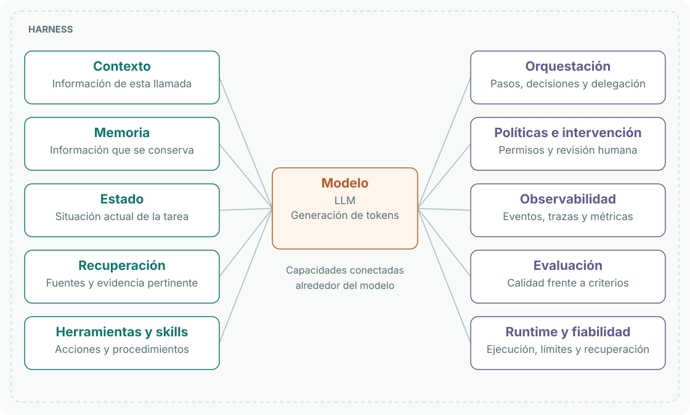
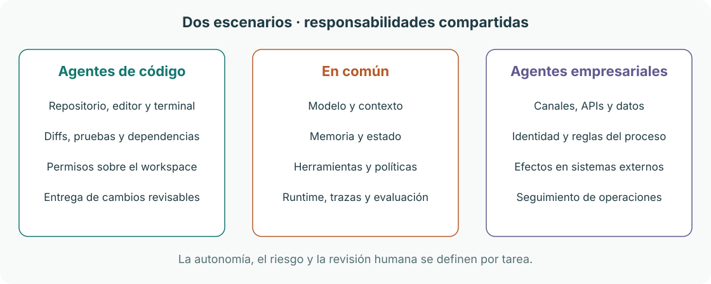
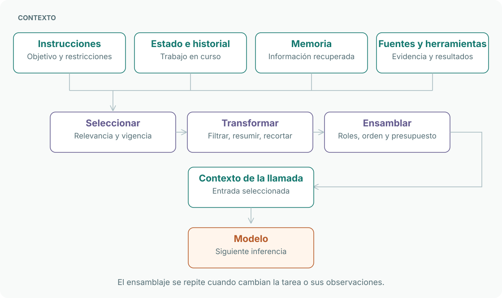

# Piloto editorial

Estado: nueva muestra propuesta tras revisar las referencias de tono; aceptación editorial pendiente.

## Muestra

Trabajaremos sobre harness, ensamblaje de contexto y un perfil de Pi. Una secuencia de diagramas conecta sistema, mecanismo e implementación: relaciones, flujos, secuencias, estados y arquitectura. Cada figura responde una pregunta y explicita su evidencia. Una prueba pequeña se añade si sirve para observar el mecanismo. Las tres páginas desarrollan el recorrido con fuentes primarias y una lectura estática de Pi en un commit fijo. No se han ejecutado Pi ni experimentos con modelos.

## Qué decidiremos juntos

| Dimensión | Pregunta de revisión | Estado |
|---|---|---|
| Prosa | ¿Suena a la voz que quiere Jairzinho y articula las ideas? | open |
| Profundidad | ¿Explica lo necesario sin convertirse en un curso introductorio? | open |
| Organización | ¿Se puede pasar del sistema al detalle y regresar? | open |
| Diagramas | ¿Explican mecanismos y relaciones con claridad? | open |
| Visuales | ¿Funcionan lectura parcial, móvil y exportaciones? | open |
| Evidencia | ¿Se distingue definición, implementación y comprobación? | open |

## Iteración

Proponer variantes acotadas sobre un mismo fragmento. Registrar en el PR la variante, feedback y decisión. Git conserva las anteriores. No llenar el resto del mapa ni congelar templates hasta que esta muestra permita acordar una guía.

El piloto termina cuando Jairzinho acepta la muestra y podemos actualizar una observación sin duplicar cambios en artículos y gráficos. No implica haber estudiado todo el harness.

## Dirección editorial

Feedback de Jairzinho del 2026-10-05: títulos concretos y puntuales, sin subtítulos adornados; mayor densidad en las explicaciones, tomando el estudio previo como referencia. Se aplicó a los mismos tres artículos: definición directa, encabezados descriptivos y desarrollo de mecanismos, dependencias, ejemplos y fallos. Se conservan los 18 diagramas. La voz sigue en calibración.

El feedback posterior indica que esa revisión sigue lejos del tono buscado. Las nuevas referencias abren el harness completo y descienden a contexto, estado, memoria, checkpoint y traza. La explicación avanza mediante distinciones, ejemplos que cambian entre llamadas, esquemas y pseudocódigo. La propuesta siguiente prueba esa progresión en un fragmento acotado; no declara aceptados ni reemplaza todavía los tres artículos completos. La revisión siguiente, guiada por las capturas entregadas por Jairzinho, prioriza definición breve, mapas ordenados y enlaces para profundizar. Las capturas se usan como referencia de composición, sin importar sus marcas o afirmaciones institucionales. La muestra incluye contraste con fuentes primarias y corrige dos simplificaciones: token no equivale necesariamente a palabra, y código/empresa no determinan por sí solos autonomía o riesgo. Los diagramas son síntesis propias.

<!-- tone-sample:start -->
# Harness

Un **harness de IA** es el andamiaje de software que rodea a un modelo para convertir sus capacidades en una solución que puede actuar, mantener continuidad y operar bajo controles. [OpenAI: el sistema alrededor del modelo](https://developers.openai.com/blog/codex-as-a-platform).

Un [modelo de lenguaje grande (LLM)](../concepts/models/language-models.md), en su forma autorregresiva, genera una secuencia prediciendo el siguiente token a partir de los anteriores. El harness conecta esa generación con contexto, herramientas y ejecución. La fiabilidad y la escala requieren decisiones de diseño y validación del sistema completo.

*Síntesis propia basada en [OpenAI](https://developers.openai.com/api/docs/guides/agents/sandboxes) y [LangChain](https://www.langchain.com/blog/the-anatomy-of-an-agent-harness). Las líneas indican relación; no son una secuencia de ejecución.*

Cada caja abre una parte del sistema. **Contexto** prepara lo que recibe el modelo; **herramientas** permiten ejecutar acciones; **orquestación** coordina los pasos. Memoria, estado y runtime sostienen la continuidad. Políticas, observabilidad y evaluación permiten controlar e inspeccionar el comportamiento.

[Modelo](../concepts/models/language-models.md) · [Contexto y ensamblaje](#contexto-y-ensamblaje) · [Runtime y términos relacionados](#harness-runtime-y-harness-engineering)

## Harness, runtime y harness engineering

| Término | Qué describe |
|---|---|
| **AI harness** | El andamiaje alrededor del modelo, con un alcance que debe precisarse en cada sistema. |
| **Agent harness** | Ese andamiaje aplicado a un agente: conecta llamadas al modelo, acciones, observaciones y continuidad. |
| **Agent runtime** | La infraestructura que ejecuta el agente y gestiona su ciclo de vida; puede ofrecer persistencia, pausas y reanudación. |
| **Framework** | Las abstracciones e integraciones con las que construimos el sistema. |
| **Harness engineering** | El trabajo de diseñar, instrumentar, evaluar y mejorar el harness. |

LangChain distingue runtime, framework y harness en su ecosistema; OpenAI describe el harness como el sistema que conduce el modelo y sus herramientas. Las fronteras pueden solaparse. **Harness engineering es una práctica; runtime es una responsabilidad de ejecución.** [LangChain: términos](https://docs.langchain.com/oss/python/concepts/products) · [LangChain: ingeniería del harness](https://www.langchain.com/blog/the-anatomy-of-an-agent-harness).

## Agentes de código y agentes empresariales

Comparten mecanismos. Cambian las tareas, el entorno, las herramientas y los criterios de resultado.

*Comparación conceptual propia. Los grupos muestran énfasis de diseño, no capacidades exclusivas.*

Un agente de código puede trabajar sobre un repositorio, producir un diff y ejecutar pruebas. Uno empresarial puede coordinar consultas y operaciones sobre APIs. Ambos pueden requerir identidad, aislamiento, recuperación y aprobación humana. El nivel de autonomía depende del efecto de cada acción, no de la etiqueta del agente. OpenAI describe el uso de un mismo harness en interfaces y flujos de distintos dominios. [Fuente](https://developers.openai.com/blog/codex-as-a-platform).

## Contexto y ensamblaje

**Contexto es la información que recibe el modelo en una llamada.** Estado, memoria y fuentes externas pueden aportar información; el ensamblaje selecciona qué entra y cómo se representa. [Anthropic: context engineering](https://www.anthropic.com/engineering/effective-context-engineering-for-ai-agents).

*Proceso propuesto. Las flechas muestran preparación de datos; las transformaciones se aplican según la necesidad de la llamada.*

| Concepto | Función |
|---|---|
| **Estado** | Mantener los datos que necesita la tarea para continuar. |
| **Memoria** | Conservar información para recuperarla dentro de un alcance definido. |
| **Contexto** | Entregar al modelo la información elegida para esta llamada. |
| **Ensamblaje** | Construir esa entrada: contenido, roles, relaciones, orden y presupuesto. |

Para corregir una función, la primera llamada puede recibir la tarea y las herramientas de búsqueda. La siguiente incorpora las rutas encontradas. Después entran el código leído, la prueba y el resultado de ejecución. **El contexto se reconstruye a medida que avanza el trabajo.** Conservar todo el historial no obliga a enviarlo completo en cada llamada.

Una memoria puede sobrevivir entre sesiones y no ser pertinente ahora. El estado puede incluir datos de control que el modelo no necesita. Un checkpoint permite conservar estado para recuperación; una traza registra la ejecución. La organización concreta depende del runtime. [Ejemplo: persistencia en LangGraph](https://docs.langchain.com/oss/python/langgraph/persistence).

[Profundizar en ensamblaje de contexto](../concepts/harness/context/context-assembly.md) · [Ver una implementación en Pi](../tech/pi/README.md)

## Referencias

Consultadas el 2026-10-05. Los mapas son síntesis propias; las capacidades de un producto se atribuyen a su documentación.

- [OpenAI — Codex as a platform](https://developers.openai.com/blog/codex-as-a-platform): responsabilidades del harness y usos en distintas aplicaciones.
- [OpenAI — Sandbox agents](https://developers.openai.com/api/docs/guides/agents/sandboxes): separación entre harness y entorno de ejecución.
- [LangChain — Runtimes, frameworks, and harnesses](https://docs.langchain.com/oss/python/concepts/products): distinción entre las tres categorías en su ecosistema.
- [LangChain — The anatomy of an agent harness](https://www.langchain.com/blog/the-anatomy-of-an-agent-harness): componentes y práctica de ingeniería.
- [Anthropic — Effective context engineering](https://www.anthropic.com/engineering/effective-context-engineering-for-ai-agents): selección, herramientas y gestión del contexto.
- [LangGraph — Persistence](https://docs.langchain.com/oss/python/langgraph/persistence): estado, checkpoints y almacenamiento entre threads.
<!-- tone-sample:end -->

## Comprobaciones de esta iteración

2026-10-05: los 18 bloques se renderizaron con Mermaid 11.17.0 (9 en harness, 5 en contexto y 4 en Pi), sin errores. La preview local permite zoom y desplazamiento para figuras amplias; se comprobó que a 390 px no desborde la página. El Markdown sigue siendo la fuente; la preview no es el diseño final de la web ni implica publicación. La apariencia del renderer de GitHub puede diferir.

Los validadores de la wiki comprueban metadatos, relaciones, enlaces y catálogo. Las citas de Pi apuntan al commit examinado; otras fuentes documentales registran su consulta en el estudio. La sintaxis y el renderizado no sustituyen revisar semántica, claridad ni afirmaciones.

La muestra visual sustituye sus dos Mermaid por tres SVG con composición explícita: modelo central, escenarios y ensamblaje. Los 18 Mermaid anteriores permanecen en los artículos previos, fuera de la muestra vigente. La fuente de los SVG es scripts/generate_editorial_figures.py; se verificaron el renderizado en navegador, los enlaces internos y las etiquetas dentro del área de cada SVG.
