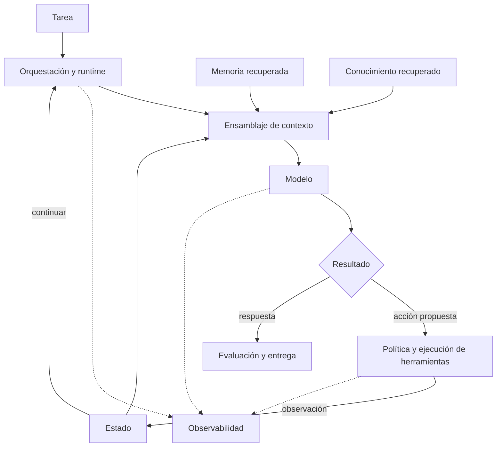
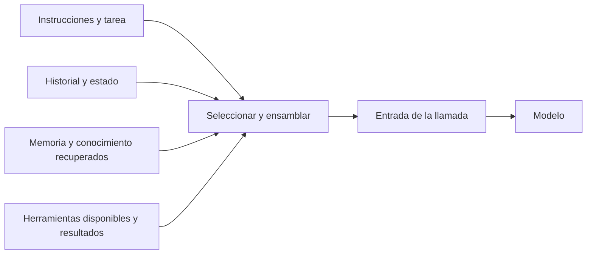

# Piloto editorial

Estado: nueva muestra propuesta tras revisar las referencias de tono; aceptación editorial pendiente.

## Muestra

Trabajaremos sobre harness, ensamblaje de contexto y un perfil de Pi. Una secuencia de diagramas conecta sistema, mecanismo e implementación: relaciones, flujos, secuencias, estados y arquitectura. Cada figura responde una pregunta y explicita su evidencia. Una prueba pequeña se añade si sirve para observar el mecanismo. Las tres páginas desarrollan el recorrido con fuentes primarias y una lectura estática de Pi en un commit fijo. No se han ejecutado Pi ni experimentos con modelos.

## Qué decidiremos juntos

| Dimensión | Pregunta de revisión | Estado |
|---|---|---|
| Prosa | ¿Suena a la voz que quiere Jairzinho y articula las ideas? | open |
| Profundidad | ¿Explica lo necesario sin convertirse en un curso introductorio? | open |
| Organización | ¿Se puede pasar del sistema al detalle y regresar? | open |
| Diagramas | ¿Explican mecanismos y relaciones con claridad? | open |
| Visuales | ¿Funcionan lectura parcial, móvil y exportaciones? | open |
| Evidencia | ¿Se distingue definición, implementación y comprobación? | open |

## Iteración

Proponer variantes acotadas sobre un mismo fragmento. Registrar en el PR la variante, feedback y decisión. Git conserva las anteriores. No llenar el resto del mapa ni congelar templates hasta que esta muestra permita acordar una guía.

El piloto termina cuando Jairzinho acepta la muestra y podemos actualizar una observación sin duplicar cambios en artículos y gráficos. No implica haber estudiado todo el harness.

## Dirección editorial

Feedback de Jairzinho del 2026-10-05: títulos concretos y puntuales, sin subtítulos adornados; mayor densidad en las explicaciones, tomando el estudio previo como referencia. Se aplicó a los mismos tres artículos: definición directa, encabezados descriptivos y desarrollo de mecanismos, dependencias, ejemplos y fallos. Se conservan los 18 diagramas. La voz sigue en calibración.

El feedback posterior indica que esa revisión sigue lejos del tono buscado. Las nuevas referencias abren el harness completo y descienden a contexto, estado, memoria, checkpoint y traza. La explicación avanza mediante distinciones, ejemplos que cambian entre llamadas, esquemas y pseudocódigo. La propuesta siguiente prueba esa progresión en un fragmento acotado; no declara aceptados ni reemplaza todavía los tres artículos completos. Sus diagramas son modelos propios y el ejemplo no describe una API ni una implementación ejecutada.

<!-- tone-sample:start -->
# Harness

Un **harness de IA** es el andamiaje de software que conecta el modelo con la ejecución de una tarea. Organiza las instrucciones, el contexto, las herramientas y el estado; además, establece cómo continúa el trabajo y cómo se comprueba el resultado. Aquí usamos el término en un sentido arquitectónico amplio. Una implementación concreta puede cubrir solo parte de estas responsabilidades.

Consideremos una tarea: **corregir una función que falla con una entrada vacía**. Para resolverla, el sistema necesita localizar el código, leer la prueba, preparar la llamada al modelo, ejecutar una edición y comprobar el resultado. La respuesta del modelo participa en ese proceso; la aplicación mantiene las conexiones entre cada paso.

## Componentes

El siguiente mapa agrupa responsabilidades. Algunas intervienen directamente en cada llamada; otras sostienen la ejecución o permiten analizarla después.

| Componente | Responsabilidad |
|---|---|
| Interfaz y acceso | Recibir la tarea e identificar quién la solicita. |
| Orquestación | Definir pasos, dependencias, decisiones, delegación e intervención humana. |
| Runtime | Ejecutar operaciones y administrar su ciclo de vida. |
| Contexto | Preparar la información de cada llamada al modelo. |
| Estado y persistencia | Mantener los datos de trabajo y puntos de recuperación. |
| Memoria | Conservar y recuperar información reutilizable entre tareas o sesiones, según su alcance. |
| Conocimiento y recuperación | Consultar documentos, código, bases de datos y otras fuentes. |
| Modelo | Producir respuestas o propuestas de acción a partir de la entrada recibida. |
| Herramientas e integraciones | Ejecutar operaciones sobre archivos, APIs y otros sistemas. |
| Seguridad y políticas | Delimitar acceso, uso de datos y acciones permitidas. |
| Fiabilidad | Tratar fallos, límites, reintentos y efectos pendientes de confirmar. |
| Observabilidad | Registrar eventos, relaciones entre operaciones y métricas. |
| Evaluación | Contrastar resultados y comportamiento con criterios definidos. |
| Operación | Gestionar configuración, versiones, despliegue y cambios del sistema. |

Estas responsabilidades se conectan. Recuperar un archivo requiere una herramienta y permisos; su contenido puede incorporarse al contexto; la ejecución actualiza el estado y emite información de observabilidad. Ubicar una operación en el mapa exige identificar su función, aunque varias funciones compartan una biblioteca.

*Relaciones de ejecución y datos; las líneas discontinuas representan emisión de telemetría. Mapa propuesto, sin distribución física de servicios.*

## Contexto, estado y memoria

En la tarea de edición, estos términos describen objetos diferentes:

| Objeto | Ejemplo | Uso |
|---|---|---|
| Estado | Archivo localizado, edición pendiente, prueba aún no ejecutada. | Continuar la tarea desde su situación actual. |
| Memoria | Una decisión validada en una sesión anterior sobre convenciones del proyecto. | Reutilizarla cuando sea pertinente y siga vigente. |
| Conocimiento | Código, pruebas y documentación consultables. | Obtener evidencia sobre el problema. |
| Contexto | Petición, instrucciones, fragmento de código y resultado de prueba seleccionados para esta llamada. | Dar al modelo la información necesaria para el siguiente paso. |
| Checkpoint | Estado persistido y datos de control necesarios para retomar la ejecución. | Recuperar el progreso dentro de las garantías del runtime. |
| Traza | Operaciones realizadas, relaciones, entradas o referencias, resultados y duración. | Inspeccionar la ejecución y apoyar su evaluación. |

Un resultado de prueba puede participar en varios objetos. Forma parte del estado si el siguiente paso depende de él. Entra en el contexto si el modelo necesita interpretar el fallo. Puede registrarse en la traza para explicar qué ocurrió. Cada uso responde a una necesidad distinta; conservar ese resultado no implica convertirlo automáticamente en memoria de largo plazo.

La memoria añade una decisión de conservación. Por ejemplo, una observación de esta tarea puede proponer una regla reutilizable, pero antes de guardarla hay que determinar su alcance, evidencia y vigencia. Un fallo aislado no basta para deducir una preferencia permanente. Una política de memoria puede aceptar el candidato, contrastarlo con información existente o descartarlo.

## Ensamblaje de contexto

**Ensamblar contexto es construir la entrada de la siguiente llamada al modelo.** El sistema reúne candidatos, selecciona los pertinentes y los representa en el formato que requiere la integración. `assemble` nombra aquí esa responsabilidad; puede estar distribuida entre varias funciones.

*Fuentes candidatas y entrada seleccionada. La disponibilidad de una fuente no implica incluirla completa.*

En nuestro ejemplo, el primer ensamblaje puede incluir la petición, las instrucciones del proyecto y las herramientas para buscar código. El modelo propone una búsqueda. El runtime la ejecuta y obtiene rutas de archivos. En la segunda llamada, esas rutas permiten decidir qué archivo leer. Después de la lectura, el contexto puede incluir el fragmento que falla y su prueba.

| Llamada | Información que se incorpora | Decisión que permite |
|---|---|---|
| 1 | Objetivo, instrucciones y herramientas de búsqueda. | Localizar la función. |
| 2 | Resultado de la búsqueda y estado de la tarea. | Elegir código y pruebas para inspeccionar. |
| 3 | Código leído, prueba y restricciones de edición. | Proponer el cambio. |
| 4 | Diff y resultado de la prueba ejecutada. | Corregir otro fallo o preparar la entrega. |

La información de una llamada puede conservarse, resumirse o quedar fuera de la siguiente. Si la búsqueda produjo muchas rutas, quizá baste con conservar las seleccionadas y una referencia al resultado completo. En cambio, la restricción de mantener la API pública debe seguir disponible mientras condicione la edición. La selección depende de la próxima decisión y de las obligaciones vigentes.

## Qué registrar

Para analizar una respuesta interesa distinguir el estado guardado de la entrada efectivamente preparada. Entre ambos puede haber selección, compactación o transformaciones de formato. Un checkpoint del estado no reconstruye necesariamente esa entrada.

Una instrumentación propuesta para el ensamblaje podría registrar las fuentes elegidas, las transformaciones aplicadas y una referencia a la entrada preparada, conforme a las reglas de acceso y conservación del proyecto. Así se puede investigar si faltó evidencia desde la recuperación o si se perdió después durante la selección. El registro ayuda a localizar el problema; determinar su causa requiere contrastarlo con el comportamiento observado.

El siguiente nivel de detalle sería implementar este mismo ejemplo con un runtime concreto y observar cada llamada. La parte conceptual define qué seguir; el perfil tecnológico identifica dónde ocurre en el código; el laboratorio comprueba lo observado bajo una configuración fija.
<!-- tone-sample:end -->

## Comprobaciones de esta iteración

2026-10-05: los 18 bloques se renderizaron con Mermaid 11.17.0 (9 en harness, 5 en contexto y 4 en Pi), sin errores. La preview local permite zoom y desplazamiento para figuras amplias; se comprobó que a 390 px no desborde la página. El Markdown sigue siendo la fuente; la preview no es el diseño final de la web ni implica publicación. La apariencia del renderer de GitHub puede diferir.

Los validadores de la wiki comprueban metadatos, relaciones, enlaces y catálogo. Las citas de Pi apuntan al commit examinado; otras fuentes documentales registran su consulta en el estudio. La sintaxis y el renderizado no sustituyen revisar semántica, claridad ni afirmaciones.

La nueva muestra añade dos diagramas, verificados junto con los 18 anteriores: 20/20 renderizados sin errores. La preview abre la propuesta y conserva las lecturas anteriores para comparación.
