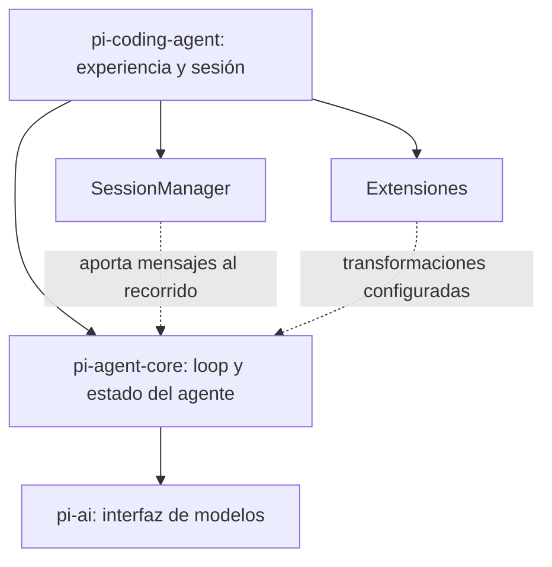
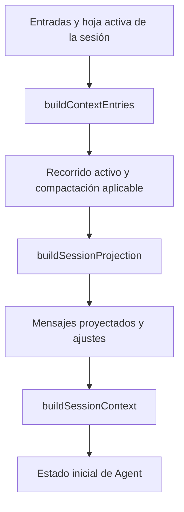
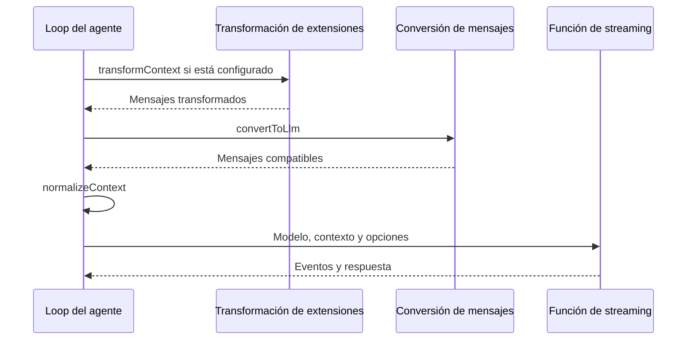
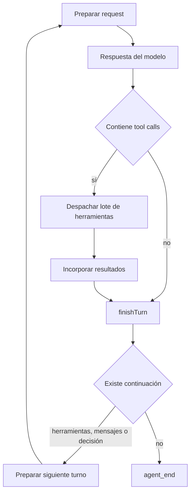

# Pi: seguir el contexto desde la sesión hasta el modelo

¿Cómo se convierte una sesión guardada en los mensajes de la siguiente llamada? Esta pregunta abre un recorrido concreto por Pi y permite contrastar [el ensamblaje de contexto](../../concepts/harness/context/context-assembly.md) con código, sin equiparar la definición general de [harness](../../concepts/harness/README.md) con un producto.

> Revisión examinada: `b2b5c42f6138b73ec4b2f49ec0ca468800f88586`, rama `main`, consultada el 2026-10-05. Los manifiestos de [pi-agent-core](https://github.com/earendil-works/pi/blob/b2b5c42f6138b73ec4b2f49ec0ca468800f88586/packages/agent/package.json) y [pi-coding-agent](https://github.com/earendil-works/pi/blob/b2b5c42f6138b73ec4b2f49ec0ca468800f88586/packages/coding-agent/package.json) declaran `1.0.2`; el commit, no esa cadena, fija esta lectura. Se inspeccionaron documentación y código. No se instaló ni ejecutó Pi, no se llamó a modelos y no se midió rendimiento. Borrador pendiente de revisión editorial y técnica por otra persona.

## 1. Qué estamos inspeccionando

El [README de esa revisión](https://github.com/earendil-works/pi/blob/b2b5c42f6138b73ec4b2f49ec0ca468800f88586/README.md#packages) presenta Pi como un harness extensible y enumera varios paquetes. Para esta pregunta interesan el agente de programación, el núcleo del agente y la API de modelos. La figura recorta ese recorrido y deja fuera los componentes que esta lectura no examina.

**Figura 1 · Vista parcial de composición.** Las flechas continuas resumen la composición examinada; las discontinuas muestran aportaciones mediadas por la configuración del SDK. Se omiten TUI, telemetría, componentes de durabilidad y otros paquetes. No son por ello capacidades ausentes.

El sitio puede describir posibilidades del producto; para localizar una responsabilidad usaremos enlaces al commit. Tampoco asumiremos que un ejemplo de extensión sea una capacidad activa por defecto.

## 2. De entradas persistidas a mensajes activos

En `sdk.ts`, la creación de sesión obtiene `existingSession` con `sessionManager.buildSessionContext()` y usa sus mensajes al inicializar `Agent`. La reconstrucción tiene etapas propias dentro de `session-manager.ts`.

**Figura 2 · Flujo derivado del código.** No es una traza ejecutada. El detalle está en [`buildContextEntries`](https://github.com/earendil-works/pi/blob/b2b5c42f6138b73ec4b2f49ec0ca468800f88586/packages/coding-agent/src/core/session-manager.ts#L476), [`buildSessionProjection`](https://github.com/earendil-works/pi/blob/b2b5c42f6138b73ec4b2f49ec0ca468800f88586/packages/coding-agent/src/core/session-manager.ts#L543) y la [inicialización del SDK](https://github.com/earendil-works/pi/blob/b2b5c42f6138b73ec4b2f49ec0ca468800f88586/packages/coding-agent/src/core/sdk.ts#L194).

`buildContextEntries` utiliza el camino de la hoja activa. Cuando encuentra compactación, conserva la más reciente como referencia y combina entradas retenidas y posteriores. `buildSessionProjection` aplica además las ediciones de contexto pertinentes y proyecta las entradas a mensajes. No envía indiscriminadamente todas las ramas del historial al modelo.

La consecuencia conceptual es importante: **la sesión persistida y la conversación activa son objetos diferentes**. El hecho de conservar un dato no implica que esté presente en la próxima llamada. Este código muestra cómo se hace una selección; no prueba que preserve toda la información necesaria para cualquier tarea.

## 3. El punto en que las extensiones cambian la llamada

Dentro del loop, `streamAssistantResponse` aplica `transformContext`, llama a `convertToLlm`, normaliza el contexto y utiliza `streamFunction`. El SDK conecta `transformContext` con `runner.emitContext(messages)` cuando existe un runner de extensiones.

**Figura 3 · Orden derivado del código.** Fuentes: [`streamAssistantResponse`](https://github.com/earendil-works/pi/blob/b2b5c42f6138b73ec4b2f49ec0ca468800f88586/packages/agent/src/agent-loop.ts#L381) y [conexión del SDK](https://github.com/earendil-works/pi/blob/b2b5c42f6138b73ec4b2f49ec0ca468800f88586/packages/coding-agent/src/core/sdk.ts#L412). El adaptador puede realizar transformaciones adicionales para el proveedor; esta figura termina en su interfaz.

Hay una precisión que se perdería en un diagrama genérico de «hook de contexto». [`emitContext`](https://github.com/earendil-works/pi/blob/b2b5c42f6138b73ec4b2f49ec0ca468800f88586/packages/coding-agent/src/core/extensions/runner.ts#L1298) distingue fases: los handlers `context` reciben la conversación sin mensajes `system`, que se restauran después; los handlers `context_with_system` trabajan con la representación completa. No son puntos de intervención equivalentes.

Por otro lado, [`convertToLlm`](https://github.com/earendil-works/pi/blob/b2b5c42f6138b73ec4b2f49ec0ca468800f88586/packages/coding-agent/src/core/messages.ts#L148) trata roles propios del agente. Convierte resúmenes de rama y compactación a mensajes para el modelo y excluye determinadas ejecuciones de bash marcadas fuera del contexto. **Seleccionar información, transformar la conversación y convertir su formato son responsabilidades distintas**, aunque participen de una misma llamada.

## 4. Qué prepara la siguiente iteración

La inspección del loop muestra preparación de request, llamada al modelo, tratamiento de herramientas y decisión de continuidad. Entre turnos también pueden refrescarse contexto y configuración.

**Figura 4 · Esquema reducido de `runLoop`.** Omite rutas de error, aborto y detalles de colas; no es pseudocódigo exhaustivo. [Fuente: `agent-loop.ts`](https://github.com/earendil-works/pi/blob/b2b5c42f6138b73ec4b2f49ec0ca468800f88586/packages/agent/src/agent-loop.ts#L163).

El despacho de herramientas selecciona ejecución secuencial o paralela según la configuración y el modo de las herramientas. No se puede deducir del diagrama que una llamada se ejecute siempre después de la anterior. La sesión instala además un hook que puede compactar antes de la próxima respuesta y refrescar prompt, herramientas y modelo. [Fuentes: `executeToolCalls`](https://github.com/earendil-works/pi/blob/b2b5c42f6138b73ec4b2f49ec0ca468800f88586/packages/agent/src/agent-loop.ts#L508) y [`_installAgentNextTurnRefresh`](https://github.com/earendil-works/pi/blob/b2b5c42f6138b73ec4b2f49ec0ca468800f88586/packages/coding-agent/src/core/agent-session.ts#L870).

El alcance de estas observaciones es estático: localizan ramas de control y puntos de extensión. No garantizan recuperación durable de cualquier efecto externo ni prueban latencia, fiabilidad o calidad de razonamiento.

## 5. Qué sabemos y qué falta probar

| Pregunta | Evidencia en esta revisión | Límite |
|---|---|---|
| ¿Se envía toda la sesión? | Hay selección de recorrido y proyección de entradas. | No se evaluó la calidad de esa selección. |
| ¿Dónde intervenir antes del modelo? | `transformContext`, `emitContext`, conversión y streaming. | El efecto depende del handler y de su configuración. |
| ¿Hay control entre turnos? | Hooks de preparación y finalización; colas de mensajes. | No se probó una política de planificación. |
| ¿Pi incluye aislamiento por nombrarse harness? | El README indica que no incorpora un sistema general de permisos para restringir archivos, procesos, red o credenciales. | El entorno o una extensión deben aportar las fronteras pertinentes; no se evaluó su seguridad. |

La última observación procede de [“Permissions & Containerization”](https://github.com/earendil-works/pi/blob/b2b5c42f6138b73ec4b2f49ec0ca468800f88586/README.md#permissions--containerization), no de inferir una ausencia porque no apareció en los archivos leídos.

Una siguiente prueba acotada puede interceptar la entrada a la función de streaming y verificar qué mensajes sobreviven a una transformación y a una reanudación. Primero se puede usar una respuesta simulada para observar el contrato sin coste de inferencia. Eso no mediría inteligencia ni calidad de tarea: mediría la construcción de la entrada. El experimento queda propuesto, no ejecutado.

Para decidir si Pi sirve como base de un harness particular, falta formular el escenario, implementar las políticas requeridas y evaluar resultados. Esta lectura aporta un mapa inspeccionable; todavía no es una recomendación de adopción ni una comparación con MAF.
